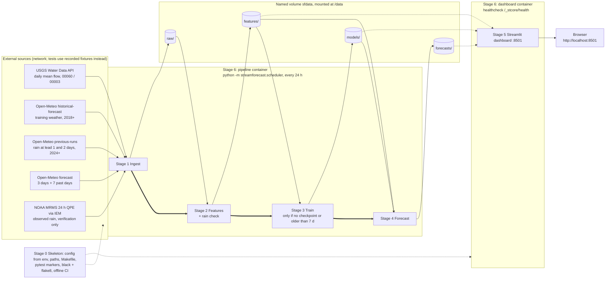

# StreamForecast — living plan

## Project

### Problem statement

The Eno River at Hillsborough, NC (USGS 02085000, 66 sq mi) swings from a trickle of a few cfs in dry spells to thousands of cfs in tropical storms (8,180 cfs on 2025-07-07, Tropical Storm Chantal). Paddlers, anglers, Eno River State Park staff, and Orange County emergency and utility planners need to know whether the river will rise or fall over the next few days, and how sure that is. StreamForecast publishes an automated daily 3-day streamflow forecast with 80% and 95% uncertainty bands, always shown next to the "no change" persistence baseline so users can judge whether the model adds value.

### Requirements

- **R1** Forecast daily mean discharge (cfs, USGS parameter 00060, statistic 00003) for 02085000 at horizons t+1, t+2, t+3, where t is the last complete USGS day (d0).
- **R2** Each forecast row carries a median and 80% and 95% bounds, ordered `lo95 ≤ lo80 ≤ median ≤ hi80 ≤ hi95` and never negative.
- **R3** Inputs: USGS daily values (new Water Data OGC API) and Open-Meteo daily `precipitation_sum`, `temperature_2m_max`, `temperature_2m_min` (historical-forecast and forecast endpoints), plus Open-Meteo previous-runs hourly precipitation at lead 1 and lead 2 days (D20), all on America/New_York calendar dates. NOAA MRMS 24-hour QPE (via IEM) is ingested as an independent observed-rain reference for **verification only**. It is never a model input (D24).
- **R4** Five stages (ingest, features, train, forecast, dashboard) hand off only through files under `DATA_DIR` (default `./data`). No stage imports another stage's module.
- **R5** Incremental ingest: after the first backfill, a run fetches only new days plus a short lookback window for revised provisional values.
- **R6** Time-series discipline: chronological splits (train 2018-01-01..2023-12-31, calibration 2024-02-01..2024-12-31, test 2025-01-01 onward; January 2024 is unused). No feature uses information from after the issue time, with **one deliberate, documented exception, limited to training rows**: there, `precip_f2` and `precip_f3` come from Open-Meteo historical-forecast data, which is stitched from forecasts made about 0 days ahead, so they are better than a real 1- or 2-day-ahead forecast (D2, RK3). **Calibration and test rows use lead-matched forecasts** from the previous-runs archive (D20), so they contain only what was forecast at issue time. Flow, antecedent precipitation, and temperature features use nothing after d0.
- **R14** Every "today", "yesterday", and "run date" is computed by `paths.local_today()`: `AS_OF_DATE` if it is set, otherwise `datetime.now(ZoneInfo(TIMEZONE)).date()`. Never `date.today()` or UTC; containers run in UTC, so at 8 pm ET UTC is already tomorrow. `AS_OF_DATE` is for fixture mode, smoke tests, and CI only; it is empty in production (D26).
- **R7** Every forecast and every metrics report includes the persistence baseline (Q[d0+h] = Q[d0]).
- **R8** One direct scikit-learn model per horizon. Intervals come from empirical residual quantiles on the calibration period. No model comparison, with **one pre-declared exception**: the single alternative that D23 allows, under D23's fixed selection rules.
- **R9** A versioned checkpoint plus a JSON metrics sidecar, including skill vs persistence and interval coverage (overall and high-flow).
- **R10** A Streamlit dashboard that reads only files under `DATA_DIR`.
- **R11** All configuration comes from environment variables with documented defaults.
- **R12** The Makefile is the public interface. Automated tests never touch the network, and CI passes offline.
- **R13** Docker Compose with two services (pipeline scheduler, dashboard) sharing a named volume, a healthcheck, and a non-root user.

### Architecture overview

Solid arrows are file hand-offs (no stage imports another). Thick arrows show the scheduler's run order inside the pipeline container. Dotted arrows are read-only.



Locally, the same stages run one at a time with `make ingest`, `make features`, `make train`, `make forecast`, `make dashboard`, or all four pipeline stages once with `make pipeline`.

### Out of scope

- Model comparison (except the single pre-declared alternative in D23, selected only on 2023), hyperparameter search, deep learning, and ensembles of different model families.
- Sub-daily (instantaneous, 15-minute) data, other gauges, and upstream routing.
- Flood-stage alerts, notifications, user accounts, and a public deployment/hosting setup.
- Databases, message queues, object storage, cron daemons, or any service beyond the two Compose services.
- Model inputs from weather sources other than Open-Meteo (MRMS is used for verification only, D24), and downscaling or bias-correcting weather.
- Retrospective hindcast archives of past issued forecasts (beyond keeping the forecast CSVs that are produced).

### Risks and design concerns

| ID | Risk | Likelihood | Impact | Mitigation |
|---|---|---|---|---|
| RK1 | USGS legacy `waterservices.usgs.gov` is "decommissioned in early 2027" (banner on its landing page, checked 2026-09-23). | Certain | High | Use `api.waterdata.usgs.gov/ogcapi/v0/collections/daily/items` from day one (D1). |
| RK2 | Train/serve weather skew: training on reanalysis while serving forecasts would make intervals too narrow. | High if unmanaged | High | Train on the Open-Meteo **historical-forecast** endpoint, which uses the same model and grid as the live forecast endpoint (D2). Verified 2026-09-23: historical-forecast values for 9/15–9/22 equal the forecast endpoint's `past_days` values. |
| RK3 | **Forecast-weather skew biases the intervals too narrow.** Historical-forecast is stitched from the shortest-lead hours of successive runs, so every training, calibration, and test row sees rain forecast about 0 days ahead: close to observed, though not the same (on 2026-09-18 the lead-0 value was 51.5 mm, all in one hour, while the gauge stayed flat). At serve time, issued on the morning of d0+1, `precip_f1` is a lead-0 forecast (today), `precip_f2` is lead-1, and `precip_f3` is lead-2. Those can be very different: for 2026-09-18 the lead-1 and lead-2 forecasts were 0.7 and 4.1 mm; for 2026-09-21, lead-0 47.2 vs lead-1 0.0 vs lead-2 24.5 mm. **Effects:** (a) the calibration residuals contain no lead-1/lead-2 weather error, so the 80%/95% bands are too narrow; (b) the gap grows with horizon (t+1 almost unaffected, t+3 most affected); (c) the misses concentrate on rain days (missed storms land above `hi`, false alarms below `lo`), the same high-flow days RK6 already weakens, while dry recession days are barely affected; (d) the model learned to trust rain that was near-certain, so the median over-reacts to forecast rain, and `r_0.50` measured on lead-0 inputs cannot correct that; (e) **AC-3.9 as written measures test coverage with lead-0 rain, so it can pass while live forecasts under-cover.** This is the documented exception to the no-future-information rule (R6). | High | High | **Fixed for the intervals (D20, Student).** Open-Meteo's previous-runs API (`previous-runs-api.open-meteo.com/v1/forecast`, hourly `precipitation_previous_dayN`, archived from **2024-01-19**) provides lead-matched forecasts. Training stays on historical-forecast (no lead archive exists before 2024), but **calibration and test** rows use lead-matched rain (`precip_f1` = lead-0 historical-forecast, `f2` = `previous_day1`, `f3` = `previous_day2`, hourly values summed per local date; AC-2.8). The residual quantiles and the median bias correction therefore absorb the real serve-time weather error for (a)–(c) and (e), and AC-3.9 measures what users will see. **Still a documented limitation:** (d) the model itself trains on near-perfect rain, so it over-trusts forecast rain, and its point skill is lower than a lead-matched model's would be. The calibration set is smaller (about 335 days; RK6). |
| RK17 | Historical-forecast accepts `start_date=2016-01-01`, but every daily value is **null for 2016-01-01..2017-12-31** (checked 2026-09-23: 731 null precipitation days; the first non-null is 2018-01-01; `gfs_seamless`, `ecmwf_ifs025`, and `ncep_gfs013` are also null in 2016). | Certain | Medium | `HISTORY_START=2018-01-01` (D18). Ingest logs a WARNING if any returned weather day is null. Features leave nulls as NaN and never fill weather. |
| RK18 | MRMS through IEM has quirks. (a) One long `multiday` request (2014–2026) returned HTTP 200 with **every `mrms_precip_in` null**, while one-year requests return complete data (2018, 2020, 2024, 2025 all non-null). (b) IEM's MRMS daily totals follow a **Central Standard Time** day ("MRMS CST Daily" on the IEM page, i.e. 06Z–06Z), which runs 1–2 hours behind the America/New_York day, so rain between about midnight and 1–2 am ET counts on the previous day. (c) The value is for IEM's 0.125° grid cell at the gauge point, not a basin average. (d) IEM is a university service (Iowa State), not an official NOAA endpoint. | Certain (a–c); Low (d outage) | Low | Request one calendar year per call and treat a response with all values null as an error (AC-1.11). Document (b) and (c) as known limitations of a verification reference. They are small next to the disagreements MRMS exists to catch (e.g. 51.5 mm vs 0.0 mm). An MRMS failure never blocks forecasting (AC-1.11). |
| RK4 | Rain sources disagree strongly: on 2026-09-18 the forecast grid gave 51.5 mm, the archive 5.6 mm, and the gauge barely moved. The forecast-grid rain can be badly wrong. | Medium | Medium | Train on the same source we serve (RK2), so the model learns how far to trust that source's rain. Keep the persistence baseline visible. |
| RK5 | Floods larger than anything in training. Tree models cannot extrapolate absolute values; the largest training peak is 3,270 cfs vs Chantal's 8,180 cfs in the test period. | Medium | High | The target is the log-change `log1p(Q[d0+h]) − log1p(Q[d0])` (D8), so predictions scale with today's flow. Floods are never clipped (AC-2.3). High-flow coverage is reported separately. |
| RK6 | The calibration period (2024-02-01..2024-12-31, 335 days after D20) has only 6 days at or above the 99th percentile (653 cfs), and 28 days above the training 90th percentile (152 cfs, 2018–2023). The 2.5% and 97.5% residual quantiles rest on about 8 points per tail, so the bands reflect mostly low-flow errors and may under-cover floods. | High | Medium | The metrics sidecar reports coverage for high-flow days separately (AC-3.5), and `make coverage` prints it (AC-3.9). Listed as a known limitation on the dashboard's metrics caption. The calibration period does include Debby (1,820 cfs, 2024-08-08) and Helene (1,810 cfs, 2024-09-27). |
| RK7 | Provisional USGS values ("Provisional") are revised later, sometimes months later. | Certain | Low | Ingest re-fetches a `USGS_LOOKBACK_DAYS` window (default 30). Features dedupe by date with the newest file winning. Forecast rows record whether the latest observation is provisional. |
| RK8 | USGS has not posted yesterday's value at run time (it was absent for "today" on 2026-09-23 and present for yesterday). A scheduler started early in the morning may often hit this. | Medium | Medium | Anchor on d0 = the last complete USGS day (D4). Forecast from a d0 up to `MAX_STALE_DAYS` (2) old, flagged, and refuse beyond that (AC-4.5, D21). The dashboard marks outdated forecasts and valid dates already in the past (AC-5.5). |
| RK9 | Leakage via weather: the Open-Meteo archive's default model returned a partial-day 15.2 mm for **today**. Interpolating gaps also uses future values. | Medium | High | Do not use the archive endpoint. Historical-forecast is requested with `end_date = yesterday`. Gaps are only forward-filled (at most 2 days), never interpolated. An automated leakage test perturbs future data (AC-2.6). |
| RK10 | Near-zero flow (current flow is about 4 cfs; record minimum since 2006 is 0.22 cfs) breaks `log`. | Medium | Medium | Use `log1p`/`expm1` everywhere and clip bounds at 0 (AC-4.3). |
| RK11 | The new USGS API returns rows **unordered**, mixes statistics unless you filter, and gives values as **strings**. | Certain | Medium | Always send `statistic_id=00003`, parse `value` as float, and sort by `time` client-side. A fixture test covers unordered input (AC-1.3). |
| RK12 | API rate limits or outages (HTTP 429/5xx, Open-Meteo `{"error": true, "reason": ...}` bodies), or a truncated forecast (fewer than 3 days). | Low–Medium | Medium | Retry with exponential backoff that honours `Retry-After` (capped at 60 s), 3 attempts. On final failure, log an error and exit non-zero without writing a partial file; later stages continue from the previous files (AC-1.5, AC-1.6). Forecast refuses to run on forecast weather not fetched today or with fewer than 3 days, and never writes partial rows (AC-4.7, AC-4.10, D21). An optional `USGS_API_KEY` is sent if set. |
| RK13 | Time-zone misalignment between USGS local days and Open-Meteo aggregation. Open-Meteo sums daily values over whatever timezone is requested. Verified on Chantal: requested in America/New_York, 2025-07-06 has 54.7 mm and 07-07 has 15.1 mm; requested in GMT, the same storm becomes 7.9 mm and 61.9 mm, which puts the heavy rain a day *after* flow jumped from 15.5 to 1,990 cfs on 07-06. The model would learn that flow rises before rain. | Medium if unpinned | High | Pin both sources to America/New_York (AC-1.10). Open-Meteo requests always send `timezone=America/New_York`, and ingest rejects any response whose `timezone` field differs. USGS `time` and Open-Meteo `daily.time` are stored verbatim as `YYYY-MM-DD` strings and never parsed into timestamps or converted to UTC. Previous-runs hourly values are summed by their local date (AC-1.9). Features join on the date string. A real-data alignment test (AC-2.5) fails if the pinning breaks. |
| RK14 | A named volume is owned by root while the container runs non-root. | Medium | Medium | Create `/data` and `chown` it to the app user in the Dockerfile before declaring it as a volume, so Docker seeds the named volume with the right owner (AC-6.4). |
| RK15 | Windows development: `make` runs in Git Bash, `python3` is not on PATH, and venv paths differ. | Medium | Low | The Makefile uses `PYTHON ?= python` and the currently active environment. It does not hard-code `.venv/bin`. CI (Ubuntu, Python 3.12) is the reference environment (D6). |
| RK16 | A checkpoint made with one scikit-learn version fails to load with another. | Low | Medium | Pin exact dependency versions and store `sklearn_version` in the checkpoint. Forecast logs a clear error on mismatch or corruption (AC-4.6). |

### Decisions log

| ID | Decision | Alternatives considered | Decided by | Why |
|---|---|---|---|---|
| D1 | Use the new USGS Water Data OGC API: `https://api.waterdata.usgs.gov/ogcapi/v0/collections/daily/items?monitoring_location_id=USGS-02085000&parameter_code=00060&statistic_id=00003&datetime=START/END&limit=10000&f=json`. | Legacy `waterservices.usgs.gov/nwis/dv` (still returns 200). | AI | The legacy landing page (checked 2026-09-23) says "WaterServices will be decommissioned in early 2027. Applications will need to migrate to the APIs hosted at https://api.waterdata.usgs.gov." Verified that the new API returns all 7,568 rows for 2006–2026 in one page with `limit=10000`, and that `datetime=` range filtering works. |
| D2 | Train on the Open-Meteo **historical-forecast** endpoint (`historical-forecast-api.open-meteo.com/v1/forecast`). This **replaces the brief's "historical archive"** at the student's direction. At serve time, use the forecast endpoint with `forecast_days=3&past_days=7`. | ERA5 / archive endpoint for 20+ years (the brief's wording); a hybrid (ERA5 for training, historical-forecast for calibration). | Student (accepted the AI's recommendation, Q2) | Same model and grid at train and serve time, so no train/serve skew. The model learns how much to trust forecast rain (RK4). The hybrid adds a second weather source for little flood signal. Accepted cost: the forecast-weather exception in R6 and RK3. |
| D3 | Training window and splits by issue date: train through 2022-12-31, calibration 2023-01-01..2024-12-31, test 2025-01-01..latest. A row is in a split only if its target date d0+h is also inside that split. (Start date amended to 2018-01-01 by D18. Splits amended by D20: train 2018-01-01..2023-12-31, calibration 2024-02-01..2024-12-31, test 2025-01-01+.) | ~20-year window 2006–2022 (ERA5); splits relative to "now". | Student (accepted the AI's recommendation, Q3, after asking whether 2016–2022 was too short) | The mid-2010s onward is the flood-richest stretch since 2006. 2006–2015 adds about 3,650 mostly low-flow days and only 17 extreme days (at or above the 99th percentile, 653 cfs). Chantal (2025) lands in test as an out-of-range stress case. Weakness accepted: few extremes in calibration (RK6), which is why high-flow coverage is reported separately. |
| D4 | Horizon anchor: d0 = last date with a valid USGS daily mean. t+h = d0+h for h = 1, 2, 3. With normal posting, d0 = yesterday, so t+1 = today, which matches `forecast_days=3` (Open-Meteo day 1 is today). | t+1 = tomorrow (needs 4 forecast days and a gap day with no observation). | Student (accepted the AI's recommendation, Q1) | Features are identical at train and serve time. When USGS is late, the model forecasts from d0 anyway and reports `stale_days`. |
| D5 | Schedule: one long-running scheduler process in the pipeline container. It runs ingest → features → (train if needed) → forecast immediately on start, then every `RUN_INTERVAL_HOURS` (default 24). It retrains when no checkpoint exists or the newest is older than `RETRAIN_DAYS` (default 7). `make pipeline` runs a single pass of the same scheduler (`--once`). | cron inside the container; a separate scheduler service; retrain every run. | Student (accepted the AI's recommendation, Q4) | Smallest thing that works, with no extra daemon. Weekly retraining picks up USGS revisions (provisional → approved) without refitting daily. |
| D6 | Python 3.12 in Docker (`python:3.12-slim`) and CI (`ubuntu-latest`). Locally, `make` runs in Git Bash with `PYTHON ?= python` inside an activated venv. Any local Python ≥ 3.12 is accepted. | Pin 3.13 everywhere; Makefile creates and uses `.venv` paths. | Student (accepted the AI's recommendation, Q5) | 3.12 has the widest wheel support for the pinned stack. Not hard-coding venv paths keeps the Makefile portable between Windows and Linux. |
| D7 | Model family: `sklearn.ensemble.HistGradientBoostingRegressor` with default hyperparameters and `random_state=0`, one model per horizon. | Ridge on log flow; RandomForestRegressor. | AI | The rain-runoff response is strongly nonlinear and depends on wetness (the same rain on dry vs wet soil gives very different flow). Gradient-boosted trees capture that without tuning, handle missing values natively, and train in seconds on about 2,190 rows. No search is performed (non-negotiable). |
| D8 | Target: log-change `y_h = log1p(Q[d0+h]) − log1p(Q[d0])`. | Absolute `log1p(Q)`; raw cfs. | AI | Tree models cannot predict beyond the target range seen in training. Predicting a ratio relative to today's flow lets forecasts scale with the current state (RK5). `log1p` handles near-zero flow (RK10). The persistence forecast corresponds to `y_h = 0`, which makes model-vs-baseline comparison natural. |
| D9 | Intervals: per horizon, calibration residuals `r = y_true − y_pred` in log-change space. Store the quantiles at 0.025, 0.10, 0.50, 0.90, 0.975. Serve `q_p = log1p(Q[d0]) + ŷ + r_p`, then `cfs = max(0, expm1(q_p))`. The median uses `r_0.50` (bias correction). Models are **not** refit on calibration data. | Quantile regression models; conformal wrappers; residuals in cfs. | AI | This is exactly what the brief asks for. Log space gives multiplicative bands, which fit flow errors that grow with flow. Using monotone transforms of ordered quantiles guarantees band ordering. Not refitting keeps the calibration residuals honest out-of-sample. |
| D10 | File formats: CSV for raw, features, and forecasts; `joblib` for model checkpoints; JSON for metrics sidecars. All file names carry a UTC timestamp `YYYYMMDDTHHMMSSZ`. | Parquet (adds pyarrow); SQLite. | AI | Human-readable during smoke tests, and no extra dependency. The data are tiny (about 4,000 rows). |
| D11 | Stage isolation: the stages `ingest`, `features`, `train`, `forecast`, `dashboard` may import only the shared helpers `config`, `paths`, `logs`. The scheduler runs stages as subprocesses (`python -m streamforecast.<stage>`), never by import. | A scheduler that imports stage functions; a Makefile-only loop. | AI | Enforces the file-handoff contract mechanically. An AST-based test checks it (AC-0.5). |
| D12 | HTTP layer: `requests`, mocked in tests with `responses`. `pytest-socket` (`--disable-socket`) makes any real network call fail the suite. | `requests-mock`; `vcrpy`; `httpx` + `respx`. | AI | Small, common, and the socket block proves "offline" rather than trusting it. |
| D13 | Gap handling: reindex to a daily calendar. Forward-fill flow only for gaps of at most `MAX_FFILL_DAYS` (default 2), and only for lag inputs. Never interpolate. Rows with a missing target or with lags still missing are dropped. | Linear interpolation; dropping every row touched by a gap. | AI | Interpolation uses the value after the gap (leakage). A short forward-fill keeps rows usable without inventing future information. |
| D14 | Value validity: **physically impossible** = non-numeric, NaN, negative, or the USGS sentinel `-999999` → dropped and counted in the log. **Extreme but real** = any finite value ≥ 0 → always kept, never clipped or winsorized. `ESTIMATED` qualifiers and `Provisional` status are kept and flagged. | Outlier removal by z-score or IQR. | AI | Floods are the signal this forecast exists for. The legacy `noDataValue` observed was `-999999.0`. The new API showed no sentinel, but the check is kept defensively. |
| D15 | Two Compose services built from the same image: `pipeline` (scheduler) and `dashboard` (Streamlit), sharing the named volume `sfdata` mounted at `/data`. | A single container running both processes. | AI | Two processes with different lifecycles (a batch loop vs a web server) are what Compose is for. A single container would need a process supervisor. One image keeps the build single. |
| D16 | Dashboard charts use Altair (already a Streamlit dependency). | Plotly; matplotlib. | AI | No new dependency. It supports layered area bands for the fan chart. |
| D18 | `HISTORY_START = 2018-01-01`, so training covers 2018-01-01..2022-12-31 (about 1,800 rows per horizon). (Training end later moved to 2023-12-31 by D20, about 2,190 rows.) | Keep 2016 and let HGB treat the missing weather as NaN; fill 2016–2017 from the ERA5 archive. | Student (AI-proposed amendment to D3; the student confirmed it at Gate 1) | Found while writing the plan: historical-forecast returns nulls for every day of 2016–2017 (RK17). 2018–2022 still holds 36 of the 76 days at or above the 99th percentile since 2006, peaking at 2,760 cfs (more than all of 2006–2015, which had 17). It loses the 2017 peaks (3,270 and 2,290 cfs) and Matthew (2016). Filling with ERA5 would reintroduce the second source D2 rejected. |
| D19 | Test-period coverage tolerances: 80% band ∈ [0.72, 0.88]; 95% band ∈ [0.90, 0.99], per horizon. Gated by `make coverage` (AC-3.9). High-flow coverage is reported, not gated. | Binomial ±2 SE with n ≈ 630 (about ±0.03); no gate, report only; conformal methods that guarantee coverage. | Student (accepted the AI's recommendation after asking how coverage would be verified) | Daily errors are strongly autocorrelated: one wet week produces a run of misses. So the effective sample is closer to about 150 independent outcomes than 630. At n_eff ≈ 150, 2.5 standard errors is about ±0.08 for the 80% band and about ±0.05 for the 95% band, with the 95% upper bound capped at 0.99 because bands that almost never miss are too wide to be useful. The check must be tight enough to catch the RK3/RK6 under-coverage it exists to expose. |
| D20 | Lead-matched forecast rain for calibration and test rows from Open-Meteo previous-runs (`precip_f2` ← `precipitation_previous_day1`, `precip_f3` ← `precipitation_previous_day2`, hourly summed per local date; `precip_f1` stays lead-0). Splits move to train 2018-01-01..2023-12-31, calibration 2024-02-01..2024-12-31, test 2025-01-01+. Training rows keep historical-forecast rain. | Document the skew only, and label AC-3.9 as an upper bound on live coverage; lead-match training too (impossible: no archive before 2024-01-19). | Student (accepted the AI's recommendation after asking how serve-time forecast weather biases the intervals) | Without it, calibration errors omit the forecast-rain error at 1 and 2 days ahead, so the bands are too narrow and the coverage check gives false comfort (RK3 a–e). Cost: one more ingest source, hourly-to-daily aggregation, and a smaller calibration set (335 vs about 730 days; RK6). |
| D21 | Forecast behaviour on missing or stale inputs. **USGS late:** forecast from d0 if `stale_days ≤ MAX_STALE_DAYS` (2), else refuse. **Provisional/estimated latest value:** use as-is and flag. **Flow lags incomplete** after the 2-day forward-fill: refuse. **Forecast weather has fewer than 3 days, contains nulls, or was not fetched today:** refuse. **Rate limit or outage:** handled in ingest (retry, then fail that source only); Forecast then applies the staleness rules to whatever files exist. A refusal never writes partial rows and never deletes an earlier forecast; the dashboard shows the newest existing forecast marked as outdated. Exit codes: 0 = forecast written or no checkpoint yet; 1 = refused or checkpoint unusable. | Fill yesterday by persistence; forecast fewer rows; widen bands when stale; refuse on provisional data. | AI | Refusing is safer than inventing inputs: a forecast built on filled flow or old weather looks as confident as a real one. Refusing on provisional data would block almost every run, because all recent USGS values are provisional (41 of 41 in 2026). A limit of 2 days is the largest at which at least one valid date (today) is still in the future. |
| D22 | With fewer than 3 forecast-rain days, Forecast refuses and writes nothing (AC-4.7 unchanged). Every horizon model keeps all three `precip_f` inputs (AC-3.2 unchanged). | Per-horizon rain inputs (the t+h model uses `precip_f1..fh` only), which would allow partial 1–2-row forecasts. | Student (kept the AI's recommendation; chose simplicity for now) | A truncated Open-Meteo response is rare (never seen during checks). Exactly 3 rows keeps the forecast file, the fan chart, and all downstream checks simple. The dashboard already shows the previous forecast as outdated. Can be revisited later. |
| D23 | **Protocol if the model performs poorly**, fixed before any results are seen. (1) **Diagnose first:** check join dates, the target and band signs, the lead-matched coverage, that features match between training and forecasting, and the MRMS rain check (AC-2.9) for the failing periods: large misses on days where Open-Meteo rain disagrees with MRMS point to a weather-input problem, not the model; bugs are fixed to match the plan and don't count as model changes. (2) If the pipeline is correct and the model still fails AC-3.8 (no skill vs persistence) at any horizon, **at most one** alternative may be tried, chosen by the student and logged here as a new Student decision (e.g. `Ridge` on the same features, or per-horizon rain inputs from D22). (3) The alternative is judged **only on 2023** (the last training year, held out and refit afterward), never on the calibration period (it sets the bands) and **never on the 2025+ test split**. (4) Whatever is chosen is re-scored once on test and reported, including when it is still worse than persistence. No grid or random search. | Open-ended tuning; comparing several model families; selecting on test results. | Student (accepted the AI's recommendation after asking whether there is a plan to improve a poor model) | The brief forbids model comparison and hyperparameter search, so the default is to accept and report the result. Diagnosing first catches the more likely cause (a bug). Pre-committing the rules and keeping selection off the test split keeps the test score an honest estimate. Near-zero skill at t+1 is plausible, because flow barely changes on dry days. It is a result to report, not something to tune away. |
| D24 | Use NOAA MRMS 24-hour multi-sensor QPE as a second, independent source of truth for rain, accessed through IEM's IEMRE API (`https://mesonet.agron.iastate.edu/iemre/multiday/{start}/{end}/{lat}/{lon}/json`, field `mrms_precip_in`, inches → mm). **Verification only:** it feeds the rain check (AC-2.9), the real-data alignment test (AC-2.5), and D23 diagnosis. It is **not** a model input. | NOAA's own archive on AWS (`noaa-mrms-pds`, `CONUS/MultiSensor_QPE_24H_Pass2_00.00/`: one 4.5 MB GRIB2 per hour, starting 2020-10-14, which would need eccodes/cfgrib and about 10 GB to backfill daily values); MRMS as antecedent-rain features. | Student chose MRMS as the second source of truth; AI chose the access path and the verification-only role | IEM returns small JSON point values back to at least 2018, so there are no GRIB2 dependencies or gigabyte downloads. Keeping MRMS out of the model avoids a new serve-time dependency and train/serve differences. The model's inputs stay exactly what the brief specifies. Evidence it is worth having: on 2026-09-18 Open-Meteo lead-0 said 51.5 mm, MRMS said 0.0 mm, and the gauge stayed flat. On Chantal (2025-07-06) MRMS said 7.01 in (178 mm) vs Open-Meteo's 54.7 mm, on the same day as the flow jump. |
| D25 | Report skill and coverage separately for **wet** windows (MRMS rain summed over d0+1..d0+h ≥ 10 mm) and **dry** windows (< 2 mm) on the test split, per horizon (AC-3.10). Reported, not gated. MRMS labels rows only after prediction. | Label rain days with Open-Meteo rain (the input being judged); no split; gate on wet-day skill. | Student (accepted the AI's suggestion) | An overall skill near zero can hide a model that beats persistence when it matters (rain) and ties it on dry days, where "no change" is almost exact. Using observed MRMS rather than the forecast rain keeps the label independent of the model's input. It also feeds step 1 of D23. The 10 mm / 2 mm cutoffs are judgment calls (the 10 mm matches the standard R10mm "heavy precipitation day" index; 2 mm absorbs MRMS noise), not tuned. **Flagged by the student to re-examine later** (see "Revisit later"). |
| D26 | Apply an external review of this plan (Codex, 2026-09-23) as triaged by the AI. (1) **Accepted:** feature availability matrix plus a marker-value test (AC-2.10). (2) **Reduced:** hard/soft failure rules with Forecast as the freshness gate, and the pass exit equal to Forecast's exit (AC-6.10). (3) **Reduced:** atomic writes for every published file (AC-0.9), and the dashboard shows the metrics matching the forecast's `model_version` (AC-5.1). (4) **Accepted:** AC-3.9 is met when the check is correct; a real-data miss is a finding under D23, not an unmet criterion. (5) **Accepted:** `AS_OF_DATE` clock injection for fixtures, CI, and smoke tests (R14, AC-0.8, AC-1.7). (6) **Accepted in part:** response validation for units, lengths, date coverage, and grid cell, plus general pagination (AC-1.12), and exact dependency pins enforced by a test (AC-0.10). (7) **Accepted:** R8 and Out of scope now name D23's single alternative as the only exception. (8) **Accepted:** metric formulas and edge cases (AC-3.5). | Adopt every recommendation in full, including a run/snapshot ID with an atomic published manifest (for 3) and a freshness/status manifest gating downstream stages (for 2), and pinning a named Open-Meteo model; or ignore the review. | Student (accepted the AI's triage of the Codex review) | The findings were valid: fixture runs would have failed on the real date, the coverage criterion was ambiguous, and metrics could silently become `NaN`. **Declined parts:** the manifests add a coordination layer that the brief's "smallest design" rules out; atomic writes, Forecast's freshness checks, and version-matched metrics fix the same failures more simply. A named Open-Meteo model isn't pinned because the verified default is what train and serve share (D2); grid-cell recording (AC-1.12) detects a silent change. |
| D17 | Offline fixture mode: `INGEST_SOURCE=fixtures` makes ingest read recorded responses from `tests/fixtures/` instead of HTTP. | No offline mode. | AI | Required by the course board ("offline fixture mode"). It lets the ingest smoke test and the container be demonstrated without network access. |

### Revisit later

Items the student deliberately parked. They are not blockers for the build. Re-examine after the Tester's review, once real metrics exist.

| ID | Item | Why it was parked | What would trigger a change |
|---|---|---|---|
| RV1 | Wet/dry cutoffs in AC-3.10 (wet ≥ 10 mm, dry < 2 mm over d0+1..d0+h; D25). | Chosen by judgment, not data. On 2025 MRMS they give t+1: 39 wet / 284 dry / 41 light, t+2: 75 / 235 / 53, t+3: 105 / 193 / 64. The wet group mixes real events with rain on dry soil that barely moves the river. | Wet-group coverage or skill that is too noisy to read (fewer than about 40 wet rows), or a clear case that a different cutoff (e.g. 1 / 25 mm, or antecedent-wetness-aware labels) separates events better. The choice must be made without looking at test-period skill for each candidate cutoff. |
| RV2 | Per-horizon rain inputs that would allow partial 1–2-row forecasts (D22). | Kept simple: truncated Open-Meteo responses are rare. | Truncated responses happen in practice (AC-4.7 refusals in the logs), or D23 selects it as the one allowed alternative. |

### Environment and commands

- **Python:** 3.12 (Docker, CI). Local ≥ 3.12 (the developer machine has 3.13.12).
- **Shell:** Git Bash on Windows, or any POSIX shell. GNU Make ≥ 4. Docker Engine with Compose v2.
- **Dependencies:** `requirements.txt` (runtime) and `requirements-dev.txt` (test/lint), with exact `==` pins chosen by the Builder at Stage 0 and recorded in its Implementation notes. Runtime: pandas, numpy, scikit-learn, joblib, requests, streamlit (which brings Altair). Dev: pytest, responses, pytest-socket, black, flake8.
- **Install:**
  ```bash
  python -m venv .venv
  source .venv/Scripts/activate   # Git Bash on Windows; use .venv/bin/activate on Linux/macOS
  make install
  ```
- **Environment variables** (all optional; defaults in `streamforecast/config.py`, documented in `.env.example`):

| Variable | Default | Meaning |
|---|---|---|
| `DATA_DIR` | `./data` (container: `/data`) | Root for raw/, features/, models/, forecasts/ |
| `USGS_SITE` | `02085000` | Gauge number |
| `LATITUDE` / `LONGITUDE` | `36.0711` / `-79.0956` | Weather point |
| `TIMEZONE` | `America/New_York` | Calendar-day definition |
| `HISTORY_START` | `2018-01-01` | First date for backfill (D18) |
| `TRAIN_END` | `2023-12-31` | Last target date in train (D20) |
| `CALIBRATION_START` | `2024-02-01` | First issue date in calibration; also where lead-matched rain begins (D20) |
| `CALIBRATION_END` | `2024-12-31` | Last target date in calibration; test follows |
| `LEADS_START` | `2024-01-25` | First date requested from previous-runs (a few days of margin before `CALIBRATION_START`) |
| `USGS_LOOKBACK_DAYS` | `30` | Re-fetch window for provisional revisions |
| `MAX_FFILL_DAYS` | `2` | Longest flow gap forward-filled |
| `MAX_STALE_DAYS` | `2` | Forecast refuses if `stale_days = (local today − 1) − d0` exceeds this (D21) |
| `RUN_INTERVAL_HOURS` | `24` | Scheduler period |
| `RETRAIN_DAYS` | `7` | Retrain when the newest checkpoint is older than this |
| `INGEST_SOURCE` | `live` | `live` or `fixtures` |
| `MRMS_ENABLED` | `1` | Set `0` to skip the MRMS verification source |
| `USGS_API_KEY` | empty | Sent as a request header if set (the Builder verifies the header name in the api.waterdata.usgs.gov docs) |
| `HTTP_TIMEOUT_S` / `HTTP_RETRIES` | `30` / `3` | HTTP behaviour |
| `LOG_LEVEL` | `INFO` | Logging level |
| `AS_OF_DATE` | empty | `YYYY-MM-DD`. If set, `paths.local_today()` returns it instead of the real date. Required with `INGEST_SOURCE=fixtures`; used by tests, CI, and fixture smoke tests. Never set in production (D26). |
| `DASHBOARD_PORT` | `8501` | Port used by `make dashboard` |

- **Make targets** (the public interface):

| Target | Does |
|---|---|
| `make help` | Lists targets with one-line descriptions |
| `make install` | `pip install -r requirements-dev.txt -e .` into the active environment |
| `make config` | Prints the resolved configuration (shows env overrides) |
| `make format` | `black .` |
| `make lint` | `black --check .` and `flake8` |
| `make test` | All offline tests (`pytest -m "unit or regression or integration"`) with sockets disabled |
| `make test-unit` / `make test-regression` / `make test-integration` | Tests for one marker |
| `make ingest` / `make features` / `make train` / `make forecast` | Run one stage once |
| `make coverage` | Prints per-horizon interval coverage from the newest metrics sidecar. Exits non-zero if outside the D19 tolerances (AC-3.9). This is a report: a real-data failure is a finding handled under D23, not a broken build. It is not part of `make test` or CI. |
| `make pipeline` | `python -m streamforecast.scheduler --once`: ingest → features → train (if needed) → forecast, one pass (built in Stage 6) |
| `make dashboard` | `streamlit run streamforecast/dashboard.py --server.port $(DASHBOARD_PORT)` |
| `make docker-build` / `make up` / `make down` / `make logs` | Compose wrappers |
| `make clean` | Removes caches (`__pycache__`, `.pytest_cache`); **never** touches `data/` |

- **Log line format** (every stage, used by the smoke tests): `2026-09-23T14:00:00Z INFO ingest usgs: fetched 7 rows 2026-09-16..2026-09-22 -> data/raw/usgs/usgs_20260923T140000Z.csv`

### Verified API facts (2026-09-23, for the Builder)

- **USGS (new API):** `features[].properties` has `time` (YYYY-MM-DD, local date), `value` (**string**), `unit_of_measure` (`ft^3/s`), `approval_status` (`Approved` / `Provisional`), `qualifier` (null or a list, e.g. `["ESTIMATED"]`), `statistic_id`, `last_modified`, `monitoring_location_id` (`USGS-02085000`). Rows come back **unordered**. Without `statistic_id=00003` the response mixes min/max/mean. Counts for 2006-01-01..2026-09-22: 7,568 rows over 7,570 days (real gaps exist); Approved 7,527, Provisional 41; qualifier null 7,441, `["ESTIMATED"]` 127; min 0.22 cfs, max 8,180 cfs on 2025-07-07; no zeros or negatives. The newest value was 2026-09-22 (today not yet posted). **Time basis:** `time` is a plain local calendar date with no timezone. The site record (`monitoring-locations`, `USGS-02085000`) has `time_zone_abbreviation: "EST"` and `uses_daylight_savings: "Y"`. The daily collection's documentation doesn't say whether the day boundary follows standard or clock time; at most that's a 1-hour difference in summer, negligible for daily means. Treat `time` as an America/New_York date and never convert it.
- **Open-Meteo forecast:** `https://api.open-meteo.com/v1/forecast?latitude=36.0711&longitude=-79.0956&daily=precipitation_sum,temperature_2m_max,temperature_2m_min&forecast_days=3&past_days=7&timezone=America%2FNew_York`. Response `daily.time`, `daily.precipitation_sum` (mm), `daily.temperature_2m_max/min` (°C), `daily_units`, `utc_offset_seconds` (-14400 in EDT). **Forecast day 1 is today.** It snaps to the grid cell (36.072, -79.109).
- **Open-Meteo historical-forecast:** `https://historical-forecast-api.open-meteo.com/v1/forecast` with the same daily variables plus `start_date` and `end_date`. It accepts dates from 2016-01-01 (an earlier `start_date` returns `{"error":true,"reason":"Parameter 'start_date' is out of allowed range from 2016-01-01 to ..."}`), **but all values are null until 2017-12-31** (RK17). One request for 2016-01-01..2026-09-22 returned 3,918 days (109 KB) in a single response, so no chunking is needed. Same grid cell and values as the forecast endpoint's `past_days`.
- **Open-Meteo previous-runs (adopted in D20):** `https://previous-runs-api.open-meteo.com/v1/forecast?...&hourly=precipitation,precipitation_previous_day1,precipitation_previous_day2&timezone=America%2FNew_York`. **Hourly only**: `daily=precipitation_sum_previous_day1` returns `{"error":true,"reason":"Invalid value: ... precipitation_sum_previous_day1"}`. Same grid cell as the forecast endpoint. The first non-null values are `previous_day1` 2024-01-19T08:00, `previous_day2` 2024-01-20T08:00, `previous_day3` 2024-01-21T08:00, so all of 2024 from February onward and all of 2025–2026 are covered. On 2025-07-06 (Chantal), `previous_day1` = 87.8 mm and `previous_day2` = 5.8 mm.
- **NOAA MRMS via IEM (D24):** `https://mesonet.agron.iastate.edu/iemre/multiday/2025-01-01/2025-12-31/36.0711/-79.0956/json` returns `{"iemre_domain":"conus","iemre_i":375,"iemre_j":105,"data":[{"date":"2025-07-06","mrms_precip_in":7.01,"prism_precip_in":...,...}]}`. `mrms_precip_in` is in **inches**. Days follow Central Standard Time (RK18b). One year per request (RK18a). Checked values: 2025-07-05 0.0, **07-06 7.01**, 07-07 0.08, 07-09 1.55, 07-10 0.35 in; 2026-09-18 **0.0** (Open-Meteo lead-0 said 51.5 mm); 2026-09-21 1.66 in (≈42 mm; Open-Meteo 47.2 mm). NOAA's own archive (`https://noaa-mrms-pds.s3.amazonaws.com/CONUS/MultiSensor_QPE_24H_Pass2_00.00/YYYYMMDD/`) has 24 hourly GRIB2 files per day of about 4.5 MB each, starting 2020-10-14; not used (D24).
- **Open-Meteo archive (not used):** the default model fills through **today** (a partial day); with `models=era5` it is null after about 6 days. Different grid cells again. This is why D2 and RK9 exist.

---

## Stage 0 — Skeleton

### Goal
A runnable, lintable, testable empty package: config from env vars, path helpers, logging, the Makefile, pytest markers, black + flake8, and a GitHub Actions CI that runs offline.

### Acceptance criteria
- [ ] AC-0.1 `make install` then `make lint` exits 0. `make lint` runs both `black --check` and `flake8`.
- [ ] AC-0.2 `make test` runs pytest with the markers `unit`, `regression`, `integration` registered (`--strict-markers`) and sockets disabled (`--disable-socket`). A `pytest_collection_modifyitems` hook in `tests/conftest.py` raises a collection error for any test that doesn't carry exactly one of the three markers. A network call fails the run.
- [ ] AC-0.3 `config.load()` returns every variable in the Environment table with its documented default, and an env var overrides each one (unit test).
- [ ] AC-0.4 `paths` helpers return `DATA_DIR/raw/usgs`, `raw/weather_hist`, `raw/weather_fc`, `raw/weather_leads`, `raw/mrms`, `features`, `models`, `forecasts`, create them on demand, and produce UTC-timestamped file names that sort chronologically. `newest(dir, pattern)` returns the lexicographically last match or `None`.
- [ ] AC-0.5 A unit test parses every stage module (`ingest`, `features`, `train`, `forecast`, `dashboard`) and the `scheduler` with `ast`, and fails if any of them imports a stage module (only `config`, `paths`, `logs` are shared). Modules that don't exist yet are skipped, so the test grows with the build.
- [ ] AC-0.8 `paths.local_today()` returns `AS_OF_DATE` when that is set, otherwise `datetime.now(ZoneInfo(TIMEZONE)).date()`. With time frozen at 2026-09-23 23:30 America/New_York (03:30 UTC on 9/24) and `AS_OF_DATE` unset, it returns 2026-09-23. With `AS_OF_DATE=2026-09-23` it returns 2026-09-23 on any real date. No module calls `date.today()` (grep in the test). Calendar-date logic (today, yesterday, staleness, fetch dates) goes through `local_today()`. Real UTC timestamps for log lines, file names, and `created_at_utc` use `paths.utc_now()` and are not affected by `AS_OF_DATE`.
- [ ] AC-0.9 **Atomic writes everywhere.** `paths.atomic_write(path, write_fn)` writes to `<path>.tmp` in the same directory and then calls `os.replace`. Every stage uses it for every published file (raw CSVs, features, rain check, MRMS verification file, checkpoint, sidecar, forecast). A glob for any published pattern never matches a `.tmp` file.
- [ ] AC-0.10 Every line of `requirements.txt` and `requirements-dev.txt` is an exact `name==version` pin (a test parses them).
- [ ] AC-0.6 `.github/workflows/ci.yml` runs on push and PR, sets up Python 3.12, and runs `make install`, `make lint`, `make test`.
- [ ] AC-0.7 `make help` lists every target in the Environment section. `make config` prints the resolved config, and `DATA_DIR=/tmp/sf make config` shows the override.

### Proposed changes
- `pyproject.toml`: package metadata, black config, pytest config (markers, `addopts = --strict-markers --disable-socket`).
- `setup.cfg` (or `.flake8`): flake8 config (max-line-length 88, exclude `.venv`, `data`).
- `requirements.txt`, `requirements-dev.txt`: exact pins.
- `streamforecast/__init__.py`: package marker and version.
- `streamforecast/config.py`: frozen dataclass `Settings` plus `load()` reading env vars.
- `streamforecast/paths.py`: directory helpers, `timestamp()`, `newest()`, `local_today()`.
- `streamforecast/logs.py`: `get_logger(stage)` with the UTC log format above.
- `streamforecast/__main__.py`: `python -m streamforecast config` prints the settings (used by `make config`).
- `Makefile`: all targets (stage targets may fail with "not implemented" until their stage lands).
- `.env.example`: every variable with its default.
- `.gitignore`: `data/`, `.venv/`, caches, `*.joblib`.
- `tests/conftest.py`: a `tmp_data_dir` fixture setting `DATA_DIR` to `tmp_path`.
- `tests/unit/test_config.py`, `tests/unit/test_paths.py`, `tests/unit/test_boundaries.py`.
- `.github/workflows/ci.yml`: offline CI.
- `README.md`: minimal install/run/test section (the student extends it at Gate 3).

### Architecture / boundaries
- May read: environment variables.
- May write: directories under `DATA_DIR` (created on demand).
- Shared modules (`config`, `paths`, `logs`) must never import any stage module or any third-party ML/HTTP library.

### Risks for this stage
- RK15 (Windows `make`/venv differences): the Makefile uses `$(PYTHON)` and never `.venv/bin`.
- pytest-socket may block the local socket that Streamlit's `AppTest` uses. If so, the Builder allows `unix`/localhost only for that test via `@pytest.mark.enable_socket`, records it, and never allows external hosts.

### Automated tests
- unit `test_config.py`: defaults and overrides → AC-0.3.
- unit `test_paths.py`: dirs, timestamp ordering, `newest()` → AC-0.4.
- unit `test_boundaries.py`: AST import rule → AC-0.5.
- unit `test_network_blocked.py`: `requests.get("https://example.com")` raises the pytest-socket error → AC-0.2.
- unit `test_marker_hook.py`: uses `pytester` to show an unmarked test causes a collection error → AC-0.2.
- unit `test_local_today.py`: frozen clock at 23:30 ET (monkeypatched `datetime`), the `AS_OF_DATE` override (and that `utc_now()` ignores it), and a grep for `date.today(` → AC-0.8.
- unit `test_atomic_write.py`: an exception inside `write_fn` leaves no target file and no stray `.tmp`; a success leaves exactly the target → AC-0.9.
- unit `test_requirements_pinned.py` → AC-0.10.
- AC-0.1, AC-0.6, AC-0.7 are checked by commands (see the smoke test) and by CI.

### Manual Smoke Test
#### What we're proving
The project installs, the Makefile is the entry point, configuration really comes from the environment, and lint runs.
#### Terminal
Terminal 1 (Git Bash, in the repo root):
```bash
python -m venv .venv
source .venv/Scripts/activate
make install
make help
make config
DATA_DIR=/tmp/sf-smoke USGS_SITE=99999999 make config
make lint
```
#### Watch for
- `make help` prints each target with a description.
- The first `make config` shows `DATA_DIR=./data`, `USGS_SITE=02085000`, `TIMEZONE=America/New_York`.
- The second shows `DATA_DIR=/tmp/sf-smoke` and `USGS_SITE=99999999`.
- `make lint` prints black's "would be left unchanged" line and flake8 prints nothing. Exit status 0 (`echo $?` prints `0`).
#### Stop
Nothing is left running. `deactivate` to leave the venv.

### Implementation notes

### Review findings

---

## Stage 1 — Ingest

### Goal
Fetch USGS daily mean discharge, Open-Meteo historical-forecast weather (past), Open-Meteo previous-runs lead-1 and lead-2 precipitation (past, from 2024; D20), and the Open-Meteo 3-day forecast (plus 7 past days), incrementally, and write normalized timestamped CSVs to `data/raw/`.

### Acceptance criteria
- [ ] AC-1.1 On an empty `DATA_DIR`, `make ingest` backfills USGS and historical-forecast weather from `HISTORY_START`, and previous-runs precipitation from `LEADS_START`, through yesterday (America/New_York), and writes one forecast file, plus MRMS from `HISTORY_START` when `MRMS_ENABLED=1`. That is five new files: `raw/usgs/usgs_<ts>.csv`, `raw/weather_hist/weather_hist_<ts>.csv`, `raw/weather_leads/weather_leads_<ts>.csv`, `raw/weather_fc/weather_fc_<ts>.csv`, `raw/mrms/mrms_<ts>.csv`.
- [ ] AC-1.2 On a second run, the USGS request starts at `max(existing date) − USGS_LOOKBACK_DAYS`, and the historical-forecast and previous-runs requests start at `max(existing date) + 1`. When nothing is new for a source, no request is made and no file is written for it. The log states each requested range.
- [ ] AC-1.3 USGS CSV columns: `date, flow_cfs, approval_status, qualifier, last_modified`. Sorted ascending by date even when the API returns rows unordered. `flow_cfs` is float. `qualifier` is a `;`-joined string or empty. Only `statistic_id=00003` is requested.
- [ ] AC-1.4 Weather CSV columns: `date, precip_mm, tmax_c, tmin_c, source, fetched_at_utc`, with `source ∈ {historical_forecast, forecast}`. The forecast file holds the 7 past days plus 3 forecast days. If the forecast endpoint returns fewer than 3 future days (today onward) or null values, the file is still written with what came back, and a WARNING `forecast returned N of 3 days` is logged (Forecast decides; AC-4.7). Every request uses `timezone=America/New_York`.
- [ ] AC-1.5 All HTTP goes through one function with a timeout, `HTTP_RETRIES` attempts, and exponential backoff on 429/5xx/connection errors. A `Retry-After` header is honoured, capped at 60 s.
- [ ] AC-1.6 On final failure (HTTP error, Open-Meteo `{"error": true}` body, or malformed JSON), ingest logs an ERROR naming the source and reason, writes no partial file for that source, still attempts the other sources, and exits non-zero. An empty USGS response (`features: []`) is logged as WARNING, writes no file, and is not a crash.
- [ ] AC-1.7 `INGEST_SOURCE=fixtures AS_OF_DATE=2026-09-23 make ingest` produces the same five file types from `tests/fixtures/` with no network access. In fixture mode, `fetched_at_utc` is stamped as 12:00 America/New_York on `AS_OF_DATE`, so fixture-mode data look fresh to Forecast on that date regardless of the real date. Fixture mode without `AS_OF_DATE` exits 1 with a clear error.
- [ ] AC-1.11 **MRMS (verification source, D24).**
  - Fetched from IEM `iemre/multiday` in one calendar-year chunk per request.
  - Incremental: a year that is already complete isn't re-requested, and the current year is re-requested from `max(existing date) − 7 days`.
  - Written to `raw/mrms/mrms_<ts>.csv` with columns `date, precip_mm, source, fetched_at_utc`, where `precip_mm = mrms_precip_in × 25.4` and `source = iem_mrms`.
  - A chunk whose `mrms_precip_in` values are all null is treated as a failed request (RK18a).
  - Any MRMS failure is logged as an ERROR for that source only: the other sources are still written, and **it does not change ingest's exit status**. Verification data must never block forecasting.
  - `MRMS_ENABLED=0` skips it entirely.
- [ ] AC-1.10 **Timezone pinning.** Every Open-Meteo request (forecast, historical-forecast, previous-runs) includes `timezone=America/New_York`, taken from `TIMEZONE`. Ingest checks that the response's `timezone` field equals the requested value; on a mismatch it logs an ERROR `timezone mismatch: requested America/New_York, got <tz>` and writes no file for that source. USGS `time` and Open-Meteo `daily.time` are written verbatim as `YYYY-MM-DD` strings: never parsed as timestamps, never localized, never converted to UTC.
- [ ] AC-1.9 Previous-runs CSV `raw/weather_leads/weather_leads_<ts>.csv` has columns `date, lead_days, precip_mm, n_hours, fetched_at_utc`, with `lead_days ∈ {1, 2}`, from hourly `precipitation_previous_day1` and `precipitation_previous_day2` requested with `timezone=America/New_York`. `precip_mm` is the sum of the hourly values on that local date. It is written only when every hour of that date is present and non-null (`n_hours` equals 23, 24, or 25 on DST-change days, as appropriate); otherwise it is NaN, and a WARNING counts the incomplete days.
- [ ] AC-1.8 Files are written atomically with `paths.atomic_write` (AC-0.9), so a crash never leaves a half-written CSV that matches the pattern.
- [ ] AC-1.12 **Response validation (D26).** Before writing, ingest checks each response; a failure is handled as a source failure (AC-1.6).
  - **Units:**
    - Open-Meteo `daily_units` must be `mm` for precipitation and `°C` for temperatures.
    - Previous-runs `hourly_units` must be `mm`.
    - Every USGS row must have `unit_of_measure == "ft^3/s"`, `statistic_id == "00003"`, and `monitoring_location_id == "USGS-" + USGS_SITE`. Non-matching USGS rows are dropped and counted, with an ERROR if any are dropped.
  - **Shape:** every data array has the same length as `time`.
  - **Date coverage:** returned dates are contiguous and cover the requested range. Missing dates are listed in a WARNING and the file is still written.
  - **Grid cell:** weather CSVs also record `grid_lat`, `grid_lon`, `elevation` from the response. Features logs a WARNING if the grid cell differs between files.
  - **Pagination:** USGS follows every `next` link until none remains (not only when `numberReturned == 10000`).

### Proposed changes
- `streamforecast/ingest.py`: `fetch_usgs`, `fetch_weather_hist`, `fetch_weather_leads`, `fetch_weather_forecast`, `http_get_json` (retry), `main()` (`python -m streamforecast.ingest`).
- `tests/fixtures/openmeteo_previous_runs.json`: a real hourly previous-runs response (`precipitation_previous_day1`, `precipitation_previous_day2`) for a few days that includes 2026-09-18 and 2026-09-21, plus one hand-edited copy with a null hour and one spanning a DST change (the edit is noted in `SOURCES.md`).
- `tests/fixtures/usgs_daily_recent.json`: a real 10-day new-API response (unordered, Provisional).
- `tests/fixtures/usgs_daily_estimated_gap.json`: a real window containing an `["ESTIMATED"]` day and a gap (the Builder finds one in the 2006–2026 record).
- `tests/fixtures/usgs_daily_chantal.json`: the real response for 2025-06-25..2025-07-15 (peak 8,180 cfs).
- `tests/fixtures/usgs_empty.json`: `{"type":"FeatureCollection","features":[],"numberReturned":0}`.
- `tests/fixtures/openmeteo_forecast_past7.json`: a real forecast response with `past_days=7`, `forecast_days=3`.
- `tests/fixtures/openmeteo_forecast_short.json`: the same response truncated to 2 forecast days.
- `tests/fixtures/openmeteo_hist_forecast.json`: a real historical-forecast response for a short window aligned with the USGS fixtures.
- `tests/fixtures/iem_mrms_chantal.json` (IEM multiday 2025-06-25..2025-07-15) and `tests/fixtures/iem_mrms_recent.json` (2026-09-12..2026-09-22, including 09-18 = 0.0 in and 09-21 = 1.66 in), plus `iem_mrms_all_null.json` (a hand-edited copy with every `mrms_precip_in` null, noted in `SOURCES.md`).
- `tests/fixtures/openmeteo_hist_chantal_et.json` and `openmeteo_hist_chantal_gmt.json`: real historical-forecast responses for 2025-06-25..2025-07-15, requested with `timezone=America/New_York` and with `timezone=GMT` (AC-2.5). Recorded 2026-09-23: 07-06 was 54.7 mm (ET) vs 7.9 mm (GMT), and 07-07 was 15.1 vs 61.9 mm.
- `tests/fixtures/openmeteo_error.json`: `{"error": true, "reason": "..."}` (served with HTTP 429 and 400 in tests).
- `tests/fixtures/SOURCES.md`: the exact URL and date each fixture was recorded (provenance).
- `tests/unit/test_ingest_parse.py`, `tests/integration/test_ingest_run.py`.

### Architecture / boundaries
- May read: `config`, `paths`, `logs`; existing `data/raw/**` (for incremental ranges); `tests/fixtures/` only when `INGEST_SOURCE=fixtures`.
- May write: `data/raw/usgs/`, `data/raw/weather_hist/`, `data/raw/weather_leads/`, `data/raw/weather_fc/`, `data/raw/mrms/`.
- Must never import: `features`, `train`, `forecast`, `dashboard`, `scheduler`.
- Must never use the Open-Meteo archive endpoint (RK9).

### Risks for this stage
RK1, RK7, RK11, RK12, RK13. Also a first-backfill payload of about 5 MB from USGS: one request with `limit=10000` is sufficient (verified). Pagination is handled generally (AC-1.12).

### Automated tests
- unit `test_parse_usgs_sorts_and_types` (unordered fixture → sorted, float) → AC-1.3.
- unit `test_parse_usgs_qualifier_join` (ESTIMATED) → AC-1.3.
- unit `test_parse_weather_columns_and_timezone_param` (asserts the request URL contains `timezone=America%2FNew_York`) → AC-1.4.
- unit `test_retry_then_success` (`responses`: 429, 429, 200) → AC-1.5.
- unit `test_retry_after_honoured_and_capped` (`Retry-After: 5` waits 5 s; `Retry-After: 600` waits 60 s; sleep is mocked) → AC-1.5.
- unit `test_short_forecast_written_with_warning` (`openmeteo_forecast_short.json`) → AC-1.4.
- unit `test_leads_hourly_to_daily` (sums per local date; a null hour gives NaN; the DST day expects 23 or 25 hours; rain at 21:00–23:00 local on day D, which is 01:00–03:00 UTC on D+1, counts on D) → AC-1.9.
- unit `test_mrms_parse_inches_to_mm` (7.01 in → 178.054 mm) and `test_mrms_yearly_chunks` (a request spanning 2024–2025 becomes two calls) → AC-1.11.
- integration `test_mrms_failure_does_not_fail_ingest` (IEM returns HTTP 500, then the all-null fixture: ERROR logged, no MRMS file, the other files written, exit status decided only by the other sources) → AC-1.11.
- unit `test_timezone_param_on_every_openmeteo_request` (all three endpoints) and `test_timezone_mismatch_rejected` (response `"timezone":"GMT"` → ERROR, no file) → AC-1.10.
- unit `test_dates_written_verbatim` (USGS `time` and Open-Meteo `daily.time` strings appear unchanged in the CSVs; a grep test finds no `tz_localize`/`tz_convert` in ingest or features) → AC-1.10.
- integration `test_backfill_empty_dir` (mocked HTTP; four files; date ranges asserted from the request URLs) → AC-1.1.
- integration `test_incremental_second_run` (existing CSV present; asserts request start dates; no historical-forecast request when up to date) → AC-1.2.
- integration `test_rate_limit_final_failure` (always 429 → non-zero exit, ERROR logged, no USGS file, weather still written) → AC-1.6.
- integration `test_empty_usgs_warns` → AC-1.6.
- integration `test_fixture_mode` (no `responses` registration; sockets disabled) → AC-1.7.
- unit `test_atomic_write_no_partial` (simulated exception mid-write leaves no matching file) → AC-1.8.
- unit `test_validate_units_and_lengths` (wrong `daily_units`, mismatched array length, wrong `unit_of_measure`/`statistic_id` rows) and `test_date_coverage_gap_warns` → AC-1.12.
- integration `test_usgs_follows_next_links` (two-page fixture made by splitting `usgs_daily_recent.json` and adding a `next` link; all rows collected once) → AC-1.12.
- integration `test_fixture_mode_requires_as_of_date` → AC-1.7.

### Manual Smoke Test
#### What we're proving
Real data arrives from both APIs, files appear in `data/raw/`, and a second run fetches only the new or lookback days.
#### Terminal
Terminal 1:
```bash
source .venv/Scripts/activate
make ingest
ls -l data/raw/usgs data/raw/weather_hist data/raw/weather_leads data/raw/weather_fc data/raw/mrms
tail -n 3 data/raw/usgs/*.csv
grep -E '^2025-07-0[5-7]|^2026-09-18' data/raw/mrms/*.csv
grep '^2026-09-18' data/raw/weather_leads/*.csv
cat data/raw/weather_fc/*.csv
make ingest
ls -l data/raw/usgs data/raw/weather_hist data/raw/weather_leads data/raw/weather_fc
INGEST_SOURCE=fixtures AS_OF_DATE=2026-09-23 DATA_DIR=/tmp/sf-fixture make ingest
```
#### Watch for
- First run: log lines like `usgs: fetched ~3,190 rows 2018-01-01..<yesterday>` and `weather_hist: fetched ~3,190 rows`, with no null-weather WARNING. The forecast file has 10 rows whose last 3 dates are today, tomorrow, and the day after.
- The USGS tail shows yesterday's date, a small cfs value, and `Provisional`.
- The log shows `mrms: fetched ... rows` for each calendar year from 2018 through this year. The MRMS grep shows 2025-07-06 at about 178 mm (07-05 and 07-07 near 0) and 2026-09-18 at 0.0 mm.
- The `weather_leads` grep shows two rows for 2026-09-18: lead 1 about 0.7 mm and lead 2 about 4.1 mm, each with `n_hours` 24. Compare them with the same-day 51.5 mm in `weather_hist`; that gap is why D20 exists.
- Second run: the USGS request range begins about 30 days back, `weather_hist: up to date, no request` and `weather_leads: up to date, no request`, and one new USGS file and one new forecast file appear.
- Fixture run: files under `/tmp/sf-fixture/raw/...` with no network errors.
#### Stop
Nothing is left running.

### Implementation notes

### Review findings

---

## Stage 2 — Features

### Goal
Merge the raw files into one daily, validated table on America/New_York dates, and build one row per issue date d0 with lagged flow, antecedent precipitation, next-3-day precipitation, and the three log-change targets.

### Acceptance criteria
- [ ] AC-2.1 Raw USGS files are combined and deduplicated by `date`, and the row from the newest file wins (so revised provisional values replace old ones). The same applies to weather, where the newest file wins per date across `weather_hist` and `weather_fc`.
- [ ] AC-2.2 Impossible values (NaN, non-numeric, negative, `-999999`) are dropped, and the count is logged per reason.
- [ ] AC-2.3 Extreme but real values are kept unchanged: using the Chantal fixture, the 2025-07-07 value 8,180 cfs appears in the output `flow_cfs` exactly. No clipping, winsorizing, or outlier filtering exists in the module.
- [ ] AC-2.4 Gaps: flow gaps of at most `MAX_FFILL_DAYS` are forward-filled for lag inputs only (flag column `flow_filled`). Longer gaps leave NaN, and rows whose lags or target are NaN are excluded from training rows. Targets are never filled.
- [ ] AC-2.5 **Rain lines up with the same day's flow (real data).** Features are built from the recorded Chantal fixtures (USGS 2025-06-25..07-15 and historical-forecast in America/New_York for the same window). The resulting rows must show:
  - on 2025-07-06, `precip_0` = 54.7 and `flow_cfs` = 1990.0, and on 2025-07-05, `flow_cfs` = 15.5. The first day with ≥ 25 mm of rain is the same date as the first day flow rises more than 10× over the previous day (lag 0);
  - on 2025-07-07, `flow_cfs` = 8180.0 (peak the day after the heaviest rain), and on 2025-07-10, flow rises again to 922 after 49.7 mm on 07-09.

  An independent check uses MRMS from `iem_mrms_chantal.json`: the day of maximum MRMS rain (2025-07-06, 7.01 in) must equal the Open-Meteo heavy-rain day and the flow-jump day.

  A second fixture holds the same historical-forecast request made with `timezone=GMT` (the heavy rain shifts to 07-07, a day after the rise). Ingest rejects it under AC-1.10. When the rejection is bypassed in the test, the lag-0 assertion fails. That shows the test really detects misalignment. Features join all sources on the date string only.
- [ ] AC-2.6 No leakage: for any issue date d0, changing any flow value after d0 leaves every feature column on row d0 unchanged (targets `y_1..y_3` excluded, since they are future flow by definition). Changing any historical-forecast or forecast weather value after d0 changes only `precip_f1..f3` (the documented exception in R6 and RK3), and changing weather after d0+3 changes nothing. Tested as a property test on perturbed copies.
- [ ] AC-2.7 Output `data/features/features_<ts>.csv` with columns: `date` (d0), `flow_cfs`, `approval_status`, `qualifier`, `flow_filled`, `logq_0`, `logq_1`, `logq_2`, `dlogq_1`, `precip_0`, `api_7`, `api_30`, `precip_f1`, `precip_f2`, `precip_f3`, `weather_lead_matched`, `fc_fetched_date`, `tmax_0`, `tmin_0`, `doy_sin`, `doy_cos`, `y_1`, `y_2`, `y_3`. It includes the latest d0 row (targets NaN). `fc_fetched_date` is the local date on which the forecast file that supplied that row's `precip_f*` was fetched; it is set only on the latest row. At most the 5 newest features files are kept. All features outputs are written with `paths.atomic_write` (AC-0.9).
- [ ] AC-2.10 **Every feature follows the availability matrix** below (D26). Test: build features from fixtures where each source carries a distinct marker value (historical-forecast = 1.0 mm, previous-runs lead 1 = 2.0, lead 2 = 3.0, `weather_fc` = 4.0) and assert, for one train row, one calibration row, one test row, and the live row, that every weather feature equals the marker of the source the matrix names, and that no feature reads a date after its "Latest data" column.
- [ ] AC-2.9 **Rain check against MRMS (verification only, D24).** When raw MRMS files exist, Features also writes `data/features/rain_check_<ts>.json` for dates from `CALIBRATION_START` onward.
  - **Per Open-Meteo rain series** (`lead0` = historical-forecast, `lead1`, `lead2`), versus MRMS: `n`, `bias_mm`, `mae_mm`, `hits` (MRMS ≥ 10 mm and Open-Meteo ≥ 10 mm), `misses` (MRMS ≥ 10 mm, Open-Meteo < 2 mm), and `false_alarms` (Open-Meteo ≥ 10 mm, MRMS < 2 mm).
  - **The 10 dates with the largest absolute disagreement**, with both values.
  - **Logging:** Features logs one summary line per series.
  - **Model inputs unchanged:** no MRMS-derived column ever appears in `features_*.csv`. If MRMS files are missing, the rain check is skipped with a WARNING, and the features output is unaffected.
  - **Verification file for Train:** Features also writes the deduplicated MRMS series to its own file, `data/features/mrms_<ts>.csv` (`date, mrms_mm`), for the rain-day/dry-day evaluation (AC-3.10). It is a separate file from `features_*.csv` and is never joined into it.
  - **Fixture check:** built from the recent fixtures, 2026-09-18 is counted as a `lead0` false alarm (51.5 mm vs 0.0 mm).
- [ ] AC-2.8 Lead-matched rain (D20). For rows with `CALIBRATION_START ≤ d0 < latest d0`: `precip_f1` = historical-forecast precipitation on d0+1 (lead 0), `precip_f2` = previous-runs `lead_days=1` on d0+2, and `precip_f3` = previous-runs `lead_days=2` on d0+3, with `weather_lead_matched = True`. If a lead value is missing, it stays NaN; it is **never** back-filled from historical-forecast. Rows before `CALIBRATION_START` use historical-forecast for all three, with `weather_lead_matched = False`. The latest row takes `precip_f1..f3` from the newest `weather_fc` file (the live forecast; `weather_lead_matched = True`). Verified on the fixture: row d0 = 2026-09-16 has `precip_f2` equal to the 2026-09-18 lead-1 value (0.7 mm), not 51.5 mm.

Feature definitions (all relative to issue date d0): `logq_k = log1p(flow[d0−k])`; `dlogq_1 = logq_0 − logq_1`; `precip_0` = precipitation on d0; `api_7`, `api_30` = precipitation summed over d0−6..d0 and d0−29..d0; `precip_fh` = precipitation on d0+h (source per AC-2.8); `tmax_0`, `tmin_0` on d0; `doy_sin/cos` from the day of year of d0; `y_h = log1p(flow[d0+h]) − logq_0`.

**Feature availability matrix (D26).** Issue time is the morning of d0+1 (America/New_York). "Latest data" is the last valid date a feature may use.

| Feature | Train rows (d0 < 2024-02-01) | Calibration and test rows (d0 ≥ 2024-02-01) | Live row (serve) | Latest data | Available at issue time? |
|---|---|---|---|---|---|
| `logq_0..2`, `dlogq_1` | USGS daily mean | USGS daily mean | USGS daily mean (may be provisional) | d0 | Yes: d0's value is posted by d0+1 (RK8 covers late posting) |
| `precip_0`, `tmax_0`, `tmin_0` | historical-forecast, d0 | historical-forecast, d0 | newest `weather_fc` `past_days` value for d0 | d0 | Yes: verified identical to historical-forecast for past days (2026-09-15..22) |
| `api_7`, `api_30` | historical-forecast, d0−6..d0 / d0−29..d0 | same | `weather_fc` `past_days` for d0−6..d0, historical-forecast for older days | d0 | Yes |
| `precip_f1` | historical-forecast, d0+1 (≈ lead 0) | historical-forecast, d0+1 (lead 0) | `weather_fc` day 1 (today, lead 0) | forecast issued on d0+1 | Yes |
| `precip_f2` | historical-forecast, d0+2 (≈ lead 0: **documented exception**, R6/RK3) | previous-runs `lead_days=1`, d0+2 | `weather_fc` day 2 (lead 1) | forecast issued on d0+1 | Train: no (exception); others: yes |
| `precip_f3` | historical-forecast, d0+3 (**documented exception**) | previous-runs `lead_days=2`, d0+3 | `weather_fc` day 3 (lead 2) | forecast issued on d0+1 | Train: no (exception); others: yes |
| `doy_sin`, `doy_cos` | calendar | calendar | calendar | d0 | Yes |
| MRMS (any) | never a feature | never a feature | never a feature | n/a | n/a (verification only, D24) |

### Proposed changes
- `streamforecast/features.py`: `load_raw_usgs`, `load_raw_weather`, `validate_flow`, `build_features`, `main()`.
- `tests/unit/test_features_validation.py`, `tests/unit/test_features_build.py`, `tests/regression/test_features_chantal.py`, `tests/unit/test_features_leakage.py`.

### Architecture / boundaries
- May read: `data/raw/**`, `config`, `paths`, `logs`.
- May write: `data/features/`.
- Must never import: `ingest`, `train`, `forecast`, `dashboard`, `scheduler`. It never makes network calls.

### Risks for this stage
RK5 (never clip), RK7 (revisions), RK9 (leakage via fill), RK10 (log1p), RK13 (dates).

### Automated tests
- unit `test_newest_file_wins` → AC-2.1.
- unit `test_impossible_values_dropped` (−5, −999999, "abc", NaN) → AC-2.2.
- regression `test_chantal_peak_survives` (fixture → 8,180.0 in output) → AC-2.3.
- unit `test_gap_1_day_filled_gap_10_days_not` → AC-2.4.
- regression `test_chantal_rain_and_flow_same_local_date` (ET fixtures: exact values and lag 0) → AC-2.5.
- unit `test_feature_availability_matrix` (marker-value test) → AC-2.10.
- regression `test_mrms_peak_day_matches_flow_jump` (Chantal MRMS fixture) → AC-2.5.
- unit `test_rain_check_metrics_and_false_alarm` (2026-09-18 flagged; counts and bias against hand-computed values) → AC-2.9.
- unit `test_no_mrms_column_in_features` and `test_rain_check_skipped_without_mrms` (features byte-identical with and without MRMS files) → AC-2.9.
- regression `test_gmt_fixture_breaks_alignment` (GMT fixture fed past the ingest check: lag-0 assertion fails, proving the test is sensitive) → AC-2.5.
- unit `test_no_future_information` (perturbation property test) → AC-2.6.
- unit `test_output_columns_and_latest_row` plus `test_prunes_old_feature_files` → AC-2.7.
- unit `test_lead_matched_rain_by_period` (before/after `CALIBRATION_START`; the 2026-09-18 lead-1 value used, not 51.5 mm; a missing lead stays NaN) → AC-2.8.

### Manual Smoke Test
#### What we're proving
Raw files become one feature table, floods are kept, and the newest row is ready for forecasting.
#### Terminal
Terminal 1:
```bash
source .venv/Scripts/activate
make features
ls -l data/features
head -n 3 data/features/features_*.csv
tail -n 2 data/features/features_*.csv
grep -E '^2025-07-0[5-7]' data/features/features_*.csv
cat data/features/rain_check_*.json
```
#### Watch for
- Log lines: rows read per source, `dropped impossible: 0 negative, 0 sentinel, ...`, `forward-filled N days`, and `wrote K rows (latest d0=<yesterday>)`.
- The header shows the AC-2.7 columns.
- The last row has yesterday's date, filled `precip_f1..f3`, today's date in `fc_fetched_date`, and empty `y_1..y_3`.
- The log reports `lead-matched rows: ~970 (from 2024-02-01)`, and `weather_lead_matched` switches from False to True at 2024-02-01.
- The three Chantal rows show rain and flow on the same day: 07-05 has about 0 mm and 15.5 cfs; 07-06 has about 54.7 mm (`precip_0`) and 1990.0 cfs; 07-07 has about 15.1 mm and 8180.0 cfs. If the heavy rain appears on 07-07 instead, the timezone pinning is broken.
- The rain-check JSON shows bias, MAE, hits, misses, and false alarms for `lead0`, `lead1`, `lead2` against MRMS. Its top-disagreement list includes 2026-09-18 (Open-Meteo 51.5 mm vs MRMS 0.0 mm) and probably 2025-07-06 (54.7 vs about 178 mm). Expect more false alarms and misses at lead 1–2 than at lead 0.
#### Stop
Nothing is left running.

### Implementation notes

### Review findings

---

## Stage 3 — Train

### Goal
Fit one `HistGradientBoostingRegressor` per horizon on the train split, compute residual quantiles on the calibration split, evaluate on the test split against persistence, and publish a versioned checkpoint plus a metrics sidecar.

### Acceptance criteria
- [ ] AC-3.1 Splits come from `TRAIN_END`, `CALIBRATION_START`, and `CALIBRATION_END`, by date: train covers ..`TRAIN_END`, calibration covers `CALIBRATION_START`..`CALIBRATION_END`, and test covers after `CALIBRATION_END`. Rows between `TRAIN_END` and `CALIBRATION_START` are unused. A row belongs to a split only if both d0 and d0+h fall inside it. Every calibration and test row has `weather_lead_matched = True`; training aborts with an error if not. Rows with a NaN feature are dropped from calibration and test and counted in the log (HGB would accept them, but they would not be lead-matched). The three splits do not overlap and are strictly ordered in time, and no shuffling occurs anywhere (test asserts max(train date) < min(calibration date) < min(test date) per horizon).
- [ ] AC-3.2 Three models (h = 1, 2, 3) with `random_state=0` and default hyperparameters, fit only on train rows, target `y_h`, on the feature columns listed in AC-2.7 (excluding `date`, `flow_cfs`, `approval_status`, `qualifier`, `flow_filled`, `weather_lead_matched`, `fc_fetched_date`, and the targets).
- [ ] AC-3.3 The residual quantiles at 0.025, 0.10, 0.50, 0.90, 0.975 per horizon come from calibration rows only, are stored in the checkpoint, and are non-decreasing.
- [ ] AC-3.4 Checkpoint `data/models/model_<ts>.joblib` contains `models`, `residual_quantiles`, `feature_columns`, `sklearn_version`, `split_dates`, and `trained_at_utc`. Sidecar `data/models/metrics_<ts>.json` has the same `<ts>`, and both store `model_version = <ts>`. Both are written with `paths.atomic_write` (AC-0.9), the checkpoint first and the sidecar last; a checkpoint without a sidecar counts as unpublished. The sidecar is valid JSON with no `NaN`/`Infinity` (`allow_nan=False`); missing values are `null`.
- [ ] AC-3.5 The sidecar reports, per horizon on the test split: `n`, model `mae_cfs`, `rmse_cfs`, `nse`; persistence `mae_cfs`, `nse`; `skill_mae = 1 − mae_model/mae_persistence`; `coverage_80`, `coverage_95`; and `coverage_80_high`, `coverage_95_high`, `n_high` for days whose observed flow at d0+h exceeds the training 90th percentile of flow. Calibration-split coverage is reported too.
  **Metric definitions (D26), for every group (overall, high-flow, wet, dry):**
  - **Common rows:** model and persistence are scored on exactly the same rows: those with an observed target and complete features (`n` counts them).
  - **Formulas** (o = observed cfs at d0+h, p = prediction in cfs):
    - `mae = mean|o−p|`
    - `rmse = sqrt(mean (o−p)²)`
    - `nse = 1 − Σ(o−p)² / Σ(o−ō)²`
    - `skill_mae = 1 − mae_model / mae_persistence`
    - `coverage_x` = share of rows with `lo_x ≤ o ≤ hi_x`
  - **Edge cases:**
    - `nse` is `null` when `Σ(o−ō)² = 0`.
    - `skill_mae` is `null` when `mae_persistence = 0`.
    - A group with `n < 20` reports every metric as `null` with `"status": "insufficient"`, otherwise `"status": "ok"`; an empty group has `n = 0`.
  - **Never silent:** no metric is ever computed from mismatched rows or reported as `NaN`.
- [ ] AC-3.6 On a synthetic stationary series (fixed seed, generated in the test), calibration and test coverage of the 80% band are within 0.80 ± 0.05 and of the 95% band within 0.95 ± 0.03, and the model beats persistence (`skill_mae > 0`) at h = 1.
- [ ] AC-3.7 Deterministic: two runs of `make train` on the same features file produce identical predictions and quantiles.
- [ ] AC-3.8 Training logs a WARNING (not an error) for any horizon where `skill_mae ≤ 0` or the AC-3.9 coverage check fails. Training still publishes. The Tester records either condition on real data as a finding.
- [ ] AC-3.10 **Rain-day / dry-day split (D25).**
  - **Classification:** each test row for horizon h is classified by observed MRMS rain summed over its forecast window d0+1..d0+h, taken from the newest `data/features/mrms_*.csv`:
    - **wet** if ≥ 10 mm;
    - **dry** if < 2 mm;
    - **light** in between (counted only).
  - **Sidecar key:** per horizon, `by_rain = {"wet": {...}, "dry": {...}, "n_light": k, "wet_mm": 10, "dry_mm": 2}`. Each group has `n`, model and persistence `mae_cfs`, `skill_mae`, `coverage_80`, `coverage_95`.
  - **Not gated:** the split is reported, not gated.
  - **MRMS stays out of the model:** it is used only to label rows **after** prediction, and the checkpoint's `feature_columns` never include it.
  - **If MRMS is unavailable:** `by_rain` is `null` and training logs a WARNING (training still succeeds).
- [ ] AC-3.9 **Test-period interval coverage check.** This criterion is met when the **check works correctly**, proven on hand-written sidecars. The **real-data result** is reported, not required to pass: an out-of-tolerance result on real data is a **finding** handled under D23 and in the Tester's review, not an unmet criterion (D26). The deterministic, strict gates are AC-3.6 (synthetic coverage and skill) and the calibration wiring check below. `make coverage` reads the newest metrics sidecar, prints a per-horizon table (`h`, `n`, `coverage_80`, `coverage_95`, `n_high`, `coverage_80_high`, `coverage_95_high`, calibration `coverage_80`/`coverage_95`, and, printed but not gated, `skill_mae` and `coverage_80` for the wet and dry groups from AC-3.10), and exits 0 only if, for **every** horizon on the **test split**:
  - `coverage_80` ∈ [0.72, 0.88] and `coverage_95` ∈ [0.90, 0.99] (tolerances from D19), and
  - calibration-split `coverage_80` and `coverage_95` are within ±0.02 of nominal. This is a wiring check: the quantiles are computed from the calibration period, so anything else means the bands are applied incorrectly.

  Coverage means the fraction of rows where `lo ≤ observed Q[d0+h] ≤ hi`, inclusive, computed in cfs using the **same band function as Forecast**. High-flow coverage is printed but not gated, because `n_high` is small and clustered in a few events (RK6). The non-zero exit is kept so a failure is visible, and `make coverage` is not part of `make test` or CI (it needs real data). **Required response to a real-data failure:** (1) if the calibration wiring check fails, it's a bug; fix it. (2) If only the test tolerances fail, the Tester records a finding with the table, and the student triages it under D23: diagnose first, then accept and document it or try the one allowed alternative. It must **not** be fixed by widening the tolerances or recomputing quantiles on the test split.

### Proposed changes
- `streamforecast/train.py`: `split_by_date`, `fit_horizon`, `residual_quantiles`, `bands`, `evaluate`, `publish`, `main()`, plus `--report` (reads the newest sidecar, prints the coverage table, applies the AC-3.9 thresholds, and sets the exit code).
- `Makefile`: `coverage` target → `$(PYTHON) -m streamforecast.train --report`.
- `tests/unit/test_train_split.py`, `tests/unit/test_train_quantiles.py`, `tests/regression/test_train_synthetic_coverage.py`, `tests/integration/test_train_publish.py`.

### Architecture / boundaries
- May read: the newest `data/features/features_*.csv`; the newest `data/features/mrms_*.csv` (evaluation labels only, AC-3.10); `config`, `paths`, `logs`.
- May write: `data/models/`.
- Must never import: `ingest`, `features`, `forecast`, `dashboard`, `scheduler`. No network.

### Risks for this stage
RK3, RK5, RK6, RK16. There is also a risk of subtle leakage at split edges; mitigated by requiring d0+h inside the split (AC-3.1).

### Automated tests
- unit `test_splits_time_ordered_no_overlap` → AC-3.1.
- unit `test_fit_uses_train_rows_only` → AC-3.2.
- unit `test_quantiles_from_calibration_and_ordered` → AC-3.3.
- integration `test_publish_checkpoint_and_sidecar` (tmp `DATA_DIR`, small synthetic features file) → AC-3.4, AC-3.5 (keys and types present).
- regression `test_synthetic_coverage_and_skill` → AC-3.6.
- regression `test_deterministic_training` → AC-3.7.
- unit `test_warns_when_no_skill` → AC-3.8.
- unit `test_coverage_report_thresholds` (hand-written sidecars: one inside every tolerance → exit 0; test `coverage_80 = 0.70` → exit 1; calibration `coverage_80 = 0.75` → exit 1; boundaries 0.72 and 0.88 pass) → AC-3.9.
- unit `test_rain_split_labels_and_metrics` (a hand-built MRMS series: window sums 0, 5, 12 mm → dry, light, wet; the h=3 window is d0+1..d0+3; group metrics match hand-computed values) → AC-3.10.
- unit `test_rain_split_null_without_mrms` and `test_checkpoint_features_exclude_mrms` → AC-3.10.
- unit `test_metric_edge_cases` (constant observations → `nse` null; zero persistence error → `skill_mae` null; a 19-row group → `insufficient`; an empty wet group → `n = 0`; the model and persistence row sets are identical; the sidecar parses with `allow_nan=False`) → AC-3.5, AC-3.10.
- unit `test_coverage_inclusive_and_in_cfs` (an observation exactly on a bound counts as covered; the computation goes through `bands()`) → AC-3.9.

### Manual Smoke Test
#### What we're proving
A real model is trained on 2018–2023, calibrated on 2024-02..2024-12 with lead-matched forecast rain, and scored on 2025+ (also lead-matched), and we can read its skill against persistence.
#### Terminal
Terminal 1:
```bash
source .venv/Scripts/activate
make train
ls -l data/models
cat data/models/metrics_*.json
```
#### Watch for
- Log lines per horizon: `h=1 train n=~2190 cal n=~330 test n=~625`, then `h=1 test MAE model X vs persistence Y (skill Z)` and `coverage80 A coverage95 B (high-flow A' B')`.
- Two new files with the same timestamp: `model_<ts>.joblib` and `metrics_<ts>.json`.
- The JSON shows three horizons with the AC-3.5 keys. Note whether skill is positive and whether high-flow coverage is lower than overall (RK6).
- Then run `make coverage; echo "exit=$?"`. You should see a readable table with one row per horizon. Calibration coverage should be about 0.80 and 0.95 (wiring check). Test coverage is the honest number; watch whether it drops from h=1 to h=3 (RK3). In the wet/dry columns, expect skill near 0 on dry days (flow barely changes, so persistence is hard to beat) and any real skill to show up on wet days. Expect coverage to be lower on wet days (RK3c, RK6). `exit=0` means every horizon is inside the D19 tolerances; `exit=1` names the failing horizon.
#### Stop
Nothing is left running.

### Implementation notes

### Review findings

---

## Stage 4 — Forecast

### Goal
Load the newest published checkpoint and the newest features row, and write a 3-day forecast with median, 80%, and 95% bounds next to the persistence baseline.

### Acceptance criteria
- [ ] AC-4.1 The output `data/forecasts/forecast_<d0>_<ts>.csv` has exactly 3 rows (h = 1, 2, 3) and columns: `issue_date` (d0), `valid_date`, `horizon`, `median_cfs`, `lo80_cfs`, `hi80_cfs`, `lo95_cfs`, `hi95_cfs`, `persistence_cfs`, `latest_obs_cfs`, `latest_obs_provisional`, `latest_obs_estimated`, `stale_days`, `fc_fetched_date`, `model_version`, `created_at_utc`. `model_version` is the checkpoint's `<ts>` (AC-3.4). The file is written with `paths.atomic_write` (AC-0.9).
- [ ] AC-4.2 Bounds are computed as in D9: `q_p = logq_0 + ŷ_h + r_p`, `cfs = max(0, expm1(q_p))`, and `median_cfs` uses `r_0.50`.
- [ ] AC-4.3 On every row, `0 ≤ lo95 ≤ lo80 ≤ median ≤ hi80 ≤ hi95`.
- [ ] AC-4.4 No published checkpoint (no `model_*.joblib` with a matching `metrics_*.json`): log `no checkpoint yet; skipping forecast` at WARNING, write nothing, exit 0.
- [ ] AC-4.5 **USGS hasn't posted yesterday.** `stale_days = (paths.local_today() − 1 day) − d0` (America/New_York, R14).
  - `stale_days = 0`: normal.
  - `1 ≤ stale_days ≤ MAX_STALE_DAYS` (2): forecast from d0 anyway. Valid dates stay d0+1..d0+3, so one or two of them may already be in the past. Log a WARNING `USGS data through <d0>, <k> day(s) stale`. `stale_days` is written on every row.
  - `stale_days > MAX_STALE_DAYS`: log an ERROR `USGS data through <d0> is <k> days stale (limit 2); not forecasting`, write nothing, exit 1.
  - Never fill the missing days (no persistence fill, no extrapolation).
- [ ] AC-4.6 A corrupt or unloadable checkpoint (bad bytes, missing keys, `sklearn_version` mismatch): log an ERROR naming the file, write nothing, exit 1.
- [ ] AC-4.7 **Fewer than 3 forecast days.** If any of `precip_f1..f3` on the latest row is missing or null (a truncated or partly-null Open-Meteo response): log an ERROR `forecast weather has N of 3 days for <d0+1>..<d0+3>; not forecasting`, write nothing, exit 1. No partial files with 1 or 2 rows are ever written.
- [ ] AC-4.8 **Provisional or estimated latest value.** It is used as-is (no refusal, no band widening), and flagged with `latest_obs_provisional` (`approval_status == "Provisional"`) and `latest_obs_estimated` (`qualifier` contains `ESTIMATED`). Logged at INFO.
- [ ] AC-4.9 **Incomplete flow history.** If any of `logq_0`, `logq_1`, `logq_2` on the latest row is NaN after the Features forward-fill (a gap longer than `MAX_FFILL_DAYS` within d0−2..d0): log an ERROR `flow lags incomplete at <d0>`, write nothing, exit 1.
- [ ] AC-4.10 **Rate limit or outage upstream.** Forecast makes no HTTP calls; ingest handles retries (AC-1.5, AC-1.6). Forecast requires `fc_fetched_date == paths.local_today()` on the latest row. If the newest forecast weather is older (for example because today's Open-Meteo call hit 429 on every retry), log an ERROR `forecast weather is stale (fetched <date>); not forecasting`, write nothing, exit 1. A USGS-only failure is handled by the staleness rules in AC-4.5.
- [ ] AC-4.11 **Refusals are safe.** In every refusal case (AC-4.5 beyond the limit, 4.6, 4.7, 4.9, 4.10), earlier `forecast_*.csv` files are left untouched, and the scheduler continues its loop. Exit codes: 0 = forecast written, or no checkpoint yet (AC-4.4); 1 = refused or checkpoint unusable.

### Proposed changes
- `streamforecast/forecast.py`: `load_newest_checkpoint`, `latest_row`, `predict_bands`, `main()`.
- `tests/unit/test_forecast_bands.py`, `tests/integration/test_forecast_run.py`.

### Architecture / boundaries
- May read: the newest `data/models/model_*.joblib` and its sidecar, the newest `data/features/features_*.csv`, `config`, `paths`, `logs`.
- May write: `data/forecasts/`.
- Must never import: `ingest`, `features`, `train`, `dashboard`, `scheduler`. No network.

### Risks for this stage
RK3, RK8, RK10, RK12, RK16. When `stale_days` is 1 or 2, `precip_f` for already-past valid dates comes from the forecast file's `past_days` (lead-0), which is more accurate than what calibration assumed, so bands for those rows are slightly conservative. That is acceptable. Also: joblib loads pickles. Only files this pipeline wrote into its own volume are ever loaded; this is documented, not "fixed".

### Automated tests
- unit `test_bands_formula_and_median_bias` → AC-4.2.
- regression `test_forecast_bands_match_train_bands` (tests may import both modules even though stages may not: the same checkpoint and input row give identical bounds from `train.bands` and Forecast's band function, so measured coverage describes the served bands) → AC-4.2, AC-3.9.
- unit `test_band_ordering_and_nonnegative` (includes near-zero flow and large negative residuals) → AC-4.3.
- integration `test_forecast_writes_three_rows` → AC-4.1.
- integration `test_provisional_and_estimated_flagged` (the recent fixture is all Provisional; the estimated-gap fixture supplies an ESTIMATED latest day) → AC-4.8.
- integration `test_no_checkpoint_skips_cleanly` → AC-4.4.
- integration `test_stale_boundaries` (clock frozen; `stale_days` 0 → normal, 1 and 2 → written with a WARNING and `stale_days` on every row, 3 → refused with exit 1) → AC-4.5.
- integration `test_corrupt_checkpoint_errors` → AC-4.6.
- integration `test_short_forecast_refuses` (features built from `openmeteo_forecast_short.json`, plus a variant with a null precipitation value) → AC-4.7.
- integration `test_flow_lag_gap_refuses` (a 3-day gap ending at d0−1) → AC-4.9.
- integration `test_stale_forecast_weather_refuses` (`fc_fetched_date` = yesterday) → AC-4.10.
- integration `test_refusal_keeps_previous_forecast` (a prior forecast file exists; every refusal case leaves it byte-identical and adds no file; exit codes asserted) → AC-4.11.

### Manual Smoke Test
#### What we're proving
A forecast file appears with 3 readable rows and sane bands, and the stage behaves cleanly when there is no model.
#### Terminal
Terminal 1:
```bash
source .venv/Scripts/activate
make forecast
ls -l data/forecasts
cat data/forecasts/forecast_*.csv
DATA_DIR=/tmp/sf-empty make forecast; echo "exit=$?"
MAX_STALE_DAYS=-1 make forecast; echo "exit=$?"
ls -l data/forecasts
```
#### Watch for
- Log: `loaded model_<ts>`, `d0=<yesterday> stale_days=0`, and `wrote 3 rows -> data/forecasts/forecast_<d0>_<ts>.csv`.
- The CSV has 3 rows with valid dates of today, tomorrow, and the day after, and bounds that widen from h = 1 to h = 3, all ≥ 0. `persistence_cfs` equals `latest_obs_cfs`.
- The empty-dir run prints `no checkpoint yet; skipping forecast` and `exit=0`.
- The `MAX_STALE_DAYS=-1` run forces a staleness refusal (any d0 counts as too stale). It prints the `...days stale (limit -1); not forecasting` ERROR and `exit=1`, and the final `ls` shows the same forecast file as before: no new file, and the old one is untouched.
#### Stop
Nothing is left running.

### Implementation notes

### Review findings

---

## Stage 5 — Dashboard

### Goal
A Streamlit page that shows the last 60 days of observed flow plus the 3-day fan chart, with skill against persistence and interval coverage, reading only files under `DATA_DIR`.

### Acceptance criteria
- [ ] AC-5.1 The page reads only these files; the module imports no stage module and makes no network calls (the boundary test from AC-0.5 covers the imports).
  - **Forecast:** the newest `forecasts/forecast_*.csv`.
  - **Observed history:** the newest `features/features_*.csv`.
  - **Metrics (D26):** the metrics sidecar whose `model_version` **matches the displayed forecast's `model_version`** (`models/metrics_<model_version>.json`), not simply the newest one, so the KPIs always describe the model that made the forecast shown. If that sidecar is missing, the KPIs show "metrics unavailable for model <version>", and the page still renders.
- [ ] AC-5.2 The fan chart shows observed `flow_cfs` for the 60 days ending at d0, the forecast median, a shaded 80% band, a lighter 95% band, and the persistence line (dashed). The y-axis is labelled `cfs` and the x-axis shows dates.
- [ ] AC-5.3 The chart title states a finding computed from the data, e.g. "Flow expected to rise to about 120 cfs by Friday" (rise/fall/hold decided by comparing the h = 3 median with `latest_obs_cfs`; "hold" when within ±10%).
- [ ] AC-5.4 At most 3 KPIs: tomorrow's median (t+1), t+1 skill vs persistence (`skill_mae`, test split), and t+1 80% coverage on the test split.
- [ ] AC-5.5 Visible warnings (D21):
  - **Outdated forecast:** when the newest forecast's `created_at_utc`, converted to America/New_York, is before `local_today()` (today's run refused or hasn't happened), show a warning banner "Forecast outdated — last issued <date> from data through <issue_date>".
  - **Stale data:** a warning banner when `stale_days > 0`.
  - **Provisional or estimated latest value:** an info note when `latest_obs_provisional` or `latest_obs_estimated` is true.
  - **Past valid dates:** forecast points with `valid_date < local_today()` are drawn greyed out and labelled "past".
- [ ] AC-5.6 With an empty `DATA_DIR`, the page shows "No forecast yet — the pipeline has not produced one" and does not raise.

### Proposed changes
- `streamforecast/dashboard.py`: Streamlit app (file loading with `st.cache_data(ttl=300)`, an Altair layered chart, KPIs, banners).
- `tests/unit/test_dashboard_title.py`: a pure function `headline(forecast_df)`.
- `tests/integration/test_dashboard_app.py`: `streamlit.testing.v1.AppTest` against a tmp `DATA_DIR` with small files and an empty one.

### Architecture / boundaries
- May read: `data/forecasts/`, `data/features/`, `data/models/metrics_*.json`, `config`, `paths`.
- May write: nothing.
- Must never import: `ingest`, `features`, `train`, `forecast`, `scheduler`, joblib, or scikit-learn. It never loads model checkpoints.

### Risks for this stage
Streamlit `AppTest` and pytest-socket (see Stage 0 risk). The chart can be misread if bands are drawn on a linear axis during a flood: use a linear axis by default and add a log-scale toggle only if the Builder finds the low-flow line unreadable (no other controls).

### Automated tests
- unit `test_headline_rise_fall_hold` → AC-5.3.
- integration `test_app_renders_with_data` (chart present, exactly 3 metrics) → AC-5.2, AC-5.4.
- integration `test_app_metrics_match_forecast_model` (two sidecars exist; the forecast references the older one; the KPIs show the older one's numbers; with the matching sidecar deleted, the KPIs show "unavailable") → AC-5.1.
- integration `test_app_warnings` (cases: outdated forecast, `stale_days = 1`, provisional latest value, a past `valid_date`; clock frozen) → AC-5.5.
- integration `test_app_empty_dir` → AC-5.6.
- unit `test_boundaries` (from Stage 0) → AC-5.1.

### Manual Smoke Test
#### What we're proving
A person can open the page and read the forecast, its uncertainty, and whether it beats "no change".
#### Terminal
Terminal 1:
```bash
source .venv/Scripts/activate
make dashboard
```
Browser: open http://localhost:8501

Terminal 2 (empty-state check):
```bash
source .venv/Scripts/activate
DATA_DIR=/tmp/sf-empty DASHBOARD_PORT=8502 make dashboard
```
Browser: open http://localhost:8502
#### Watch for
- Port 8501: a sentence-style title, three KPI tiles, a chart with 60 days of observed flow flowing into a widening fan, and a dashed persistence line. A yellow banner appears if the data are provisional or stale.
- Port 8502: the "No forecast yet" message with no traceback.
#### Stop
`Ctrl+C` in Terminal 1 and Terminal 2.

### Implementation notes

### Review findings

---

## Stage 6 — Containers

### Goal
One image and two Compose services (a pipeline scheduler and the dashboard) sharing a named volume, configured by environment variables, running as non-root, with a dashboard healthcheck.

### Acceptance criteria
- [ ] AC-6.1 The `Dockerfile` uses `python:3.12-slim`, installs `requirements*.txt` in a layer before copying source (cache-friendly), installs `make`, copies the code, and sets `DATA_DIR=/data`.
- [ ] AC-6.2 `.dockerignore` excludes `data/`, `.venv/`, `__pycache__/`, `.pytest_cache/`, `.git/`, `*.joblib`, and `docs/transcripts/`.
- [ ] AC-6.3 `docker-compose.yml` defines `pipeline` (`python -m streamforecast.scheduler`) and `dashboard` (`streamlit run streamforecast/dashboard.py --server.address 0.0.0.0 --server.port 8501`, port `8501:8501`), both mounting the named volume `sfdata` at `/data` and both taking env vars with `${VAR:-default}` defaults.
- [ ] AC-6.4 Both containers run as a non-root user (`docker compose exec dashboard id -u` ≠ 0), and that user can write `/data` on a fresh named volume.
- [ ] AC-6.5 The dashboard healthcheck calls `http://localhost:8501/_stcore/health` with Python `urllib` (no curl in slim), and `docker compose ps` shows `healthy`.
- [ ] AC-6.6 `streamforecast/scheduler.py` runs the stages as subprocesses in order, continues to the next stage if one fails, runs train only when needed (D5), sleeps `RUN_INTERVAL_HOURS`, and exits within 10 s on SIGTERM (`docker compose down` does not hit the kill timeout).
- [ ] AC-6.7 Data persist: after `docker compose down` and `docker compose up -d`, the previous forecast file is still in the volume and the dashboard shows it before the next run finishes.
- [ ] AC-6.8 Tests run inside the container: `docker compose run --rm pipeline make test` exits 0.
- [ ] AC-6.9 `make pipeline` runs `python -m streamforecast.scheduler --once`: one pass of ingest → features → train (only if no checkpoint exists or the newest is older than `RETRAIN_DAYS`) → forecast, then exit.
- [ ] AC-6.10 **Hard vs soft failures (D26).**
  - **Soft (the run continues):**
    - an ingest source failure: ingest exits 1, but the scheduler still runs Features and Forecast on the existing files, and an MRMS failure never changes ingest's exit (AC-1.11);
    - a Features failure: Forecast then sees an old features file;
    - a Train failure: Forecast uses the previous published checkpoint.
  - **The gate is Forecast:** its freshness checks (AC-4.5, 4.7, 4.9, 4.10) decide whether stale or mixed inputs are acceptable. Forecast never publishes from USGS data more than `MAX_STALE_DAYS` old, or from forecast weather not fetched today.
  - **No stage is skipped** because an earlier one failed; there is no separate status file.
  - **Exit status:** after each pass, the scheduler logs one summary line, e.g. `pass summary: ingest=1 features=0 train=skipped forecast=0`. `make pipeline` (`--once`) exits with **Forecast's** exit code (0 = forecast written or no checkpoint yet; 1 = refused or failed). A failed ingest source therefore shows in the summary and logs but fails the pass only if it makes Forecast refuse.

### Proposed changes
- `Dockerfile`: slim image, non-root `app` user (uid 1000), `/data` created and chowned.
- `.dockerignore`: keeps data, venvs, caches, and git out of the image.
- `docker-compose.yml`: two services, named volume `sfdata`, healthcheck, env defaults.
- `streamforecast/scheduler.py`: loop plus a SIGTERM handler (`threading.Event().wait` instead of `sleep`).
- `tests/unit/test_scheduler.py`: stage order, retrain decision, continue-on-failure, SIGTERM stop (subprocess mocked).
- `.github/workflows/ci.yml`: add a `docker build` job (optional cheap extra).
- `README.md`: container section.

### Architecture / boundaries
- The scheduler may read `data/models/` (checkpoint age) and may start stage subprocesses. It must never import stage modules (AC-0.5).
- Containers share state only through the `sfdata` volume. The dashboard mounts it too; the dashboard code does no writes (AC-5.1).

### Risks for this stage
RK14 (volume ownership). The first container start performs the full backfill and first training, which may take a few minutes; the dashboard shows the empty state until then. If the agent's environment has no working Docker, the Builder marks AC-6.4 through AC-6.8 "not verified" and the student verifies them at Gate 2.

### Automated tests
- unit `test_scheduler_runs_stages_in_order` → AC-6.6.
- unit `test_scheduler_retrain_only_when_stale` → AC-6.6.
- unit `test_scheduler_continues_after_failure` → AC-6.6.
- unit `test_scheduler_sigterm_stops_quickly` → AC-6.6.
- unit `test_scheduler_once_exit_code` → AC-6.9.
- unit `test_scheduler_soft_failures` (ingest exits 1 and Forecast still runs; Features fails and Forecast still runs; the pass exit equals Forecast's exit; the summary line lists every stage) → AC-6.10.
- AC-6.1 through AC-6.5, AC-6.7, and AC-6.8 are verified by the smoke test commands below (and by the optional CI build job for AC-6.1).

### Manual Smoke Test
#### What we're proving
The whole system runs from containers: the pipeline fills the shared volume, the dashboard turns healthy and shows the forecast, and data survive a restart.
#### Terminal
Terminal 1 (optional first, local one-pass check of the same scheduler):
```bash
source .venv/Scripts/activate
make pipeline; echo "exit=$?"
```

Terminal 1:
```bash
docker compose build
docker compose up
```
Terminal 2:
```bash
docker compose ps
docker compose logs pipeline --tail 30
docker compose exec dashboard id -u
docker compose exec dashboard ls -l /data/raw/usgs /data/features /data/models /data/forecasts
```
Browser: open http://localhost:8501

Terminal 2 (after the first forecast appears):
```bash
docker compose down
docker compose up -d
docker compose exec dashboard ls -l /data/forecasts
docker compose run --rm pipeline make test
docker compose down
```
#### Watch for
- The pipeline logs show `ingest` → `features` → `train` → `forecast` in order, each finishing with its `wrote ...` line, then `sleeping 24h`.
- `docker compose ps` shows `dashboard` as `(healthy)` within about a minute.
- `id -u` prints `1000`, not `0`.
- The volume listing shows files in all four directories.
- The browser shows the fan chart.
- After `down`/`up -d`, the same forecast file is still listed.
- The in-container `make test` ends with all tests passing.
- `docker compose down` returns in a few seconds (clean SIGTERM).
#### Stop
`docker compose down` (add `-v` only if you intend to delete the data volume).

### Implementation notes

### Review findings
